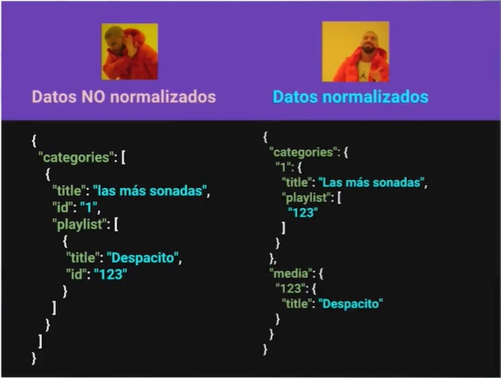

# Redux

## Tabla de Contenido
- [¿Qué es Redux?](#qué-es-redux)
  - [Historia](#historia)
  - [Motivación](#motivación)
- [Bases de Redux](#bases-de-redux)
- [Principios de Redux](#principios-de-redux)
- [Quizá tu apliación no necesite Redux](#quizá-tu-apliación-no-necesite-redux)
- [Preparando Entorno de trabajo para el Curso](#preparando-entorno-de-trabajo-para-el-curso)
- [Haciendo la configuración inicial de Redux](#haciendo-la-configuración-inicial-de-redux)
- [Entendiendo y agregando un Store](#entendiendo-y-agregando-un-store)
- [Imprimiendo Datos del Estado](#imprimiendo-datos-del-estado)
- [Definiendo acciones a manejar](#definiendo-acciones-a-manejar)
- [Actualizando el Store con Reducers](#actualizando-el-store-con-reducers)
- [¿Qué es una función pura?](#qué-es-una-función-pura)
- [Actualizando la aplicación en cada cambio con Subscribe](#actualizando-la-aplicación-en-cada-cambio-con-subscribe)
- [Instalando React-redux](#instalando-react-redux)
- [Puliendo la estructura de datos](#puliendo-la-estructura-de-datos)
- [Agregando Store al proyecto de react](#agregando-store-al-proyecto-de-react)
- [Integrando el Store con Provider](#integrando-el-store-con-provider)
- [Conectando datos a los componentes](#conectando-datos-a-los-componentes)
- [Agregando un Reducer para manejar los datos](#agregando-un-reducer-para-manejar-los-datos)
- [Manejando acción para búsquedad de videos](#manejando-acción-para-búsquedad-de-videos)
- [Filtrando los datos de búsquedad](#filtrando-los-datos-de-búsquedad)
- [Añadiendo los datos filtrados](#añadiendo-los-datos-filtrados) 
- [Conceptos Avanzados de Redux](#conceptos-avanzados-de-redux)
- [Normalización de Datos](#normalización-de-datos)
- [Añadiendo datos normalizados al store](#añadiendo-datos-normalizados-al-store)
- [Usando datos normalizados en las playlist](#usando-datos-normalizados-en-las-playlist)
- [Añadiendo Múltiples Reducers](#añadiendo-múltiples-reducers)
- [Usando datos inmutables en el proyecto](#usando-datos-inmutables-en-el-proyecto)
- [Actualizando un estado inmutable](#actualizando-un-estado-inmutable)
- [Añadiendo las acciones y funcionalidad modal](#añadiendo-las-acciones-y-funcionalidad-modal)
 - [Creadores de Acciones](#creadores-de-acciones)
 - [Enlazando creadores de acciones](#enlazando-creadores-de-acciones)
 - [Action Types](#action-types)
 - [Middlewares](#middlewares)
 - [Añadiendo múltiples Middlewares](#añadiendo-múltiples-middlewares)
 - [Acciones asíncronas](#acciones-asíncronas)
 - [Estado de carga](#estado-de-carga)


## ¿Qué es Redux?

Redux is a predictable state container for JavaScript apps or
_Redux es un contenedor de estado predecible para aplicaciones JavaScript._

Lo que quiere decir es que nuestro estado estaría envolviendo a la aplicación para manejar que está haciedo, que datos tiene, que datos no tiene mi apliación y estó está almacenado en un solo lugar que va a ser nuestro Store. 

Como ejemplo: va a ser un único lugar para saber si un modal está desplegado o no está desplegado, si mi aplicación tiene ciertos datos, si mi apliación va ha actualizar algunos datos, seguro mi store lo va a saber y lo va ha tener en un solo lugar. Esto es muy interesante porque es un solo centro de la verdad.

<div align="right">
  <small><a href="#tabla-de-contenido">🡡 volver al inicio</a></small>
</div>

### Historia

El creador de Redux es Adan Abramov.

"En una conferencia adan quería mostrar acerca del hot-realoading de componentes en React que es la forma de actualizar nuestra UI de React, sin que se actualice la página, Adan quería combinar está habilida que nos da webpack y combinarla con react y para esto creo Redux <3"

Redux es una forma sencilla de manipular los datos de una forma separada de la interfaz.

Luego de un Tiempo Adan es contratado para ser parte del equipo core de React y seguir haciendo 
que la tecnología que nos encanta para construir interfaces dinámicas avance.

<div align="right">
  <small><a href="#tabla-de-contenido">🡡 volver al inicio</a></small>
</div>

### Motivación

Hay más cosas que estaba resolviendo Adan con Redux ya que no solo nos va a servir para el hot-mode-replacement pero hay más cosas que estaba resolviendo con Redux, nos va a servir más cosas interesantes.

¿Por qué crear Redux o estado general de la aplicación?

Simplemente porque el Fronted es muy complejo.

Ejemplos: saber si el modal está abierto o cerrado, si la aplicación tiene ciertos datos, si la apliación quiere actualizar algunos datos, si la apliación quiere pedir datos a una API, si tenemos que manejar esos callbacks, son como 4 cosas que naturamente hacemos en apliaciones fronted pero pueden haber muchos más métodos dentro del DOM que invoquen a traer nuevos datos, podemos crear nuevos estados de acuerdo ha acciones del usuario, como algunos clicks o pasar el mouse, o mostrar alguna animación, el frontend es muy complicado por todas las necesidades que tiene que resolver en ese tiempo, también era otra de las motivaciones para que React sea una buena dentro de ese stack, porque las apliaciones son cada día más dinámicas por eso es que Redux existe.

<div align="right">
  <small><a href="#tabla-de-contenido">🡡 volver al inicio</a></small>
</div>

## Bases de Redux

**Store:** Es el centro de la verdad de todo, con métodos para actualizar, obtener y escuchar datos, el store esté pedazo que envuelve la apliación y vamos a tener métodos para actualizar, como por ejemplo cambiar un dato del valor A al valor B, el store lo va a saber y nos va a dar una forma de poder hacerlo, el Store siempre sabe en que estado estamos.

El store parece que lo hiciera todo en la apliación pero necesita hacer está negociación de cosas con otros 2 componentes dentro de redux:

**Acciones:** Las acciones son un bloque de información que envía datos desde la aplicación hacia el store. 

Por ejemplo; le doy un click y luego de darle un click, abrimos un modal, ese click es una acción, pero una acción puede estar por medio del usuario o puede ser algo que ocurra dentro de mi apliación, como por ejemplo: damos un click, y en ese click nos toca cargar algunos datos, algún llamado a una API y luego de algún tiempo que se complete mi método asincrono tenemos un callback y ese callback ejecuta una acción que sería actualizar algunos datos, como por ejemplo traer más listas de canciones, como agregar canciones.

En resumen las acciones pueden ser del usuario o acciones realizadas por la misma apliación.

**Reducers:** Cambian el estado de la apliación.

Esto es gracias a una función pura que toma el store y le manda cosas diferentes para que pueda actualizar ya sea para agregar o para eliminar datos.

**¿Como funcionaría nuestra apliación?**

- UI: serian nuestros componentes en React que a su vez puden enviar *triggers(disparadores)*
- Actions: Gracias a los triggers recibimos una acción como por ejemplo un click. Nuestra accion lo que hace a su vez es llamar a un reducer.
- Reducer: Le va a decir al estado que se cambie o actualice.
- Store: Espera la respuesta del Reducer. El store notifica al state que esta cambiado.
- State: Cuando el state cambia por fin volveremos a notificar a la UI.

UI -> Actions -> Reducer -> Store -> State -> UI.

Esté es un ciclo que se cumple siempre. Y esto es una de las bases de porque React es una buena idea porque tenemos datos en un sol sentido solo va a aver una forma de enviar acciones.

<div aling="center">

</div>
<br>

<div align="right">
  <small><a href="#tabla-de-contenido">🡡 volver al inicio</a></small>
</div>

## Principios de Redux

1. Única fuente de la verdad - Single source of truth:
Estó quiere decir que nuestro Store lo va a saber todo, tiene que saber si algún dato a cambiado o si se va a cambiar, lo tiene que saber nuestro estado. **Aunque técnicamente podemos crear multiples Store No deberías** por cada apliación single-page deberías tener únicamente 1 store. Por ejemplo al recargar la página para ir de home a contacto, sí deberiamos tener 1 store para home y otro para contacto.

2. El estado es de solo lectura - State ir read-only: 
No podemos manipular el estado a nuestro gusto aunque podemos, porque recuerda que tenemos que actualizar las cosas por alguna acción y mi acción llamará a un reducer el cual llamá al Store, store llamá al State y el State volverá a actualizar la UI. por eso tenemos que seguir ese flujo para que no pasen cosas raras y no tengas bugs dificiles de debugear.

Como el Store lo sabe todo nosotros podemos consultarle, store ¿como estoy? y el store te va a decir ¡Estoy tal cual! y tu vas a validar esto dentro de tu interfaz.

3. Los cambios se realizan con funciones Puras - Changes are made whith pure functions:
Esto hace una referencia directa dentro a los reducers que los reducers son simplemente funciones que tiene que ser funciones puras para realizar nuestros cambios es decir que simplemente vamos a hacer una función que no sea muy compleja que sea fácil de entender y fácil de leer, estó es una función pura.

<div align="right">
  <small><a href="#tabla-de-contenido">🡡 volver al inicio</a></small>
</div>

## Quizá tu apliación no necesite Redux

Para alguien con experiencia que esta tomando esté curso tendrá cierto sentido utilizar redux, pero no tiene sentido en todas las apliaciones que estas escribiendo seguramente si vas a hacer algo en tu día a día no todo va a ser totalmente complejo para que necesite redux, no todo va a tener un llamado a una API, no todo va a tener código asincrono por todas partes no todo va a ser muy interactivo, entonces no siempre tienes que decir: voy a utilizar react, entonces tengo que utilizar redux. 

No siempre tienes que meter un Stack completamente sofisticado o complejo a una apliación que no lo amerita así que te invito a reflexionarlo para que uses Redux de una forma responsable y luego no termines con aplicaciones sencillas con sobre-ingeniería, estó sería contraproducente para lo que quieres resolver con redux.

Para finalizar Redux Ama a React <3: Fueron echos para trabajer juntos aunque puden funcionar con vanilla.js o con cualquier otro framework o librería de javacript. 

En esté curso utilizaremos Redux con vanilla.js y con react, crearemos 2 proyectos diferentes implementando Redux.

<div align="right">
  <small><a href="#tabla-de-contenido">🡡 volver al inicio</a></small>
</div>

## Preparando Entorno de trabajo para el Curso

Antes de codear necesitamos instalar un par de cosas para tener todo nuestro entorno y empezar a escribir el código que tanto nos gusta.

La apliación vanilla que vamos a hacer es muy sencilla simplemente vamos a tener un estado con la lista de canciones que va a ser como una abstracción de lo que hace mi apliación final con todo y UI y vamos a poder añadirle canciones que querramos por ahi simplemente con redux y con un poco de javascript es sencilo para que lo entendamos y se fácil de explicar pero no porque no podamos hacerlo más fancy completo, pero ya como en la apliación completa tenemos React vamos a utilizar React y vamos a utilizar nuestro diseño de componentes y todo lo que tenemos.

Primero tenemos que llevarnos el código que generamos en el curso de React que vas a poder encontrar [Aquí](https://github.com/JasanHdz/TubeMedia).

Puedes descargar el proyecto como un Zip, abriendolo como apliación en Desktop o clonandolo con un git clone, en esté caso lo bajaremos como zip para crear un nuevo repositorio para esté curso.

Vamos a copiar todo el código del proyecto y lo copiaremos en una nueva carpeta en esté caso la carpeta será Redux. Despues de estó solo tenemos que instalar las dependencias del proyecto haciendo un ``npm install`` dentro del proyecto.

Antes de correr nuestro proyecto tenemos que cambiar la configuración del html y ponerlo el localhost de nuestro servidor

Ahora podemos correr nuestro proyecto con ``npm run build:dev`` 

Ahora procedemos a instalar redux de la siguiente manera: ``npm install --save redux``, también es muy recomendable instalar las herramientas de desarrollo de redux para google-chrome buscando en google: ``redux devtools``

Ahora ya tenemos instalo redux en react y ya podremos ocuparlo en nuestro proyecto.

Las devTools de redux para navegar en el tiempo las apliaciones, también podemos ver el estado de la apliación y debuggear de una manera más sencilla

<div align="right">
  <small><a href="#tabla-de-contenido">🡡 volver al inicio</a></small>
</div>

## Haciendo la configuración inicial de Redux 

Nuestro proyecto sencillo gracias a la mágia de webpack, va a ser un nuevo entrypoint que vamos a configurar en nuestro webpack.config y webpack.dev.config.
```js
entry: {
    'home': ['babel-polyfill', path.resolve(__dirname, 'src/entries/home.js')],
    'redux': ['babel-polyfill', path.resolve(__dirname, 'src/entries/redux.js')],
  },
```
Prodemos a crear nuestro archivo redux.js y un archivo html para que cargue a nuestro entrypoint, una vez esto procedemos a cargar nuestro servidor.

Una vez hecho estó procedemos a modelar un poco nuestra apliación, nuestra apliación es muy sencilla simplemente es un formulario que tiene que actualizar nuevas cnaciones y tiene una lista de canciones, así que hagamos ese pedazo de html en nuestro archivo redux, no ocuparemos react porque en este ejercicio implementaremos redux con vanilla.js 

Para empezar nuestro proyecto crearemos un formulario con un input de tipo texto el cual será un buscador que ira actualizando el estado de nuestra apliación con redux.

1. Para empezar a maniupar a nuestro formulario tenemos que referenciarlo
2. Para escuchar su evento procedemos a añadirle el evento a nuestro elemento en esté caso es el evento submit, esté evento recibe el evento y una función que es lo que hará despues del evento.
3. Creamos la función que lo que hará es evitar que la página se recargue, luego con una API del navegador para manejar los formularios llamada: FormData() la cúal es una clase que recibe por párametro un elemento formulario de DOM, en esté caso nuestro $form.
4. Nuestra clase tiene métodos y uno muy interesante es el método GET el cual nos sirve para obtener datos de nuestro formulario por medio de su title. Lo guardaremos en una variable y lo imprimiremos en consola cada vez que se ejecute el evento submit.

```js
const $form = document.getElementById('form');
console.log('hola mundo cruel')
const handleSubmit = event => {
    event.preventDefault();
    const data = new FormData($form);
    const title = data.get('title');
    console.log(title);
}
$form.addEventListener('submit', handleSubmit);
```

<div align="right">
  <small><a href="#tabla-de-contenido">🡡 volver al inicio</a></small>
</div>

## Entendiendo y agregando un Store 

Recordemos las propiedades del Store

**Store:** centro de la verdad de todo, con métodos para actualizar, obtener y escuchar cambios.

1. Contiene el estado de nuestra apliación
2. Puede acceder al estado con getState()
3. Puedes actualizar el estado con el método dispatch(action)
4. Escucha cambios con el método subscribe(listener)
5. Deja de escuchar los cambios retornando la función del método subscribe(listener)

Redux tiene un método llamado createStore, el cual podemos descoponerlo usando el destructuring de EcmaScript6 
``import { createStore } from 'redux';``

Esté método recibe 3 párametros:

1. Reducer: función pura que retorna el próximo estado 
2. PreloadState / initialState: Estado inicial de la aplicación, primer carga, llamado al api. Puede ser cualquier tipo de dato.
3. Enhancer: función que puede extender redux con capacidades añadidas por librerías externas. Es un párametro adicional, como por ejemplo la devTool de chrome que instalamos.

nuestro store sería así:
```js
import { createStore } from 'redux';
const store = createStore(
    reducer,
    initialState,
    enhancer
)
```

El reducer deberá ser una función pura, el initialState es nuestro modelado de datos, podemos hacerle incluso una referencia a la API, que también podría ser la simulación de un estado inicial, eso sería el modelado del store, en esté ejercicio, crearemos el modela como un arreglo de objetos muy sencillo como ejemplo.

```js
const initialState = [
    {
        'title': 'Despacito'
    },
    {
        'title': 'One more thing'
    },
    {
        'title': 'Echame la culpa'
    }
]
```

Para el enhancer iremos a nuestro navegador he iremos a el repositorio del redux-devtools-extension que se encuentra [Aquí](https://github.com/zalmoxisus/redux-devtools-extension) vamos a encontrar la documentación de la extensión que hemos instalado para nuestras devtools y vamos a encontrar una forma aparte de ponerla en otros entornos, como utilizarlos con nuestro store ejemplo:
```js
 const store = createStore(
   reducer, /* preloadedState, */
+  window.__REDUX_DEVTOOLS_EXTENSION__ && window.__REDUX_DEVTOOLS_EXTENSION__()
 );
```

Aquí simplemente estamos haciendole referencia a un elemento que está en window que esta en devtools, recuerda utilizar estó solo en modo desarrollo.

El Reducer es una función que debería retornar el estado esto quiere decir que la función recibirá el estado y tenemos retornar ese estado.

El Store quedaría así:

```js
const store = createStore(
    (state) => state,
    initialState,
    window.__REDUX_DEVTOOLS_EXTENSION__ && window.__REDUX_DEVTOOLS_EXTENSION__()
) 
```

Con estó tendremos nuestro Store listo, si vamos a nuestro navegador en las devtools veremos la opción de redux veremos las herramientas de redux, y ver en la pestaña de Log monitor nuestro estado inicial.

Las herramientas de redux aparte de servirme para debugear y saber que tengo en mi estado, también me van a servir para moverme en el tiempo, poder ver que está y cambiar los datos del store. Recuerda utilizar esto solo modo de desarrollo 

<div align="right">
  <small><a href="#tabla-de-contenido">🡡 volver al inicio</a></small>
</div>

## Imprimiendo Datos del Estado

Ya creamos nuestro centro de la verdad, nuestro Store y nuestro Store tiene un estado, y ese estado contiene esa lista o array con nuestra lista de canciones, necesitamos obtener los datos del estado, del store para imprimirlos en nuestra aplicación y para eso está está clase.

El método del store ``getState()`` sirve para obtener los datos que tiene mi store y así podemos tener esa lista como hallamos modelado nuestros datos, arreglo o objeto,etc. Y utilizarlo dentro de mi apliación.

Como ejemplo podemos imprimirlo en consola para observar que se muestre el estado.

Ya que los tenemos vamos a crear un lugar para imprimirlos en el Dom, para ello vamos a crear un nuevo elemento html en nuestra página al cual le aremos una referencia en nuestro javascript

``<div id="playlist"></div>`` luego lo referenciamos ``const $container = document.getElementById('playlist');``.

Ya que tenemos nuestro contenedor iterar nuestra playlist para ponerla en una variable y imprimirla dentro del elemento $container de la siguiente manera:
```js
const $container = document.getElementById('playlist');
// creamos una variable con nuestro Store para poderlo iterar.
const playlist = store.getState();
// Creamos una vuelta por cada elemento.
playlist.forEach((item) => {
    // Creamos un elemento HTML de tipo Párrafo
    const template = document.createElement('p');
    // Cambiamos el TextContent del elemento que creamos, lo igualamos al item que estamos iterando con el valor de su title
    template.textContent = item.title;
    // Pegamos dentro de container el elemento creado y modificado
    $container.appendChild(template);
})
console.log(store.getState());
```

<div align="right">
  <small><a href="#tabla-de-contenido">🡡 volver al inicio</a></small>
</div>

## Definiendo acciones a manejar

Ya tenemos nuestro store, nuestro store tiene el estado y nuestro estado ya está siendo utilizado por nuestra apliación para mostrar los datos al usuario he imprimirlos en pantalla.

Ahora tenemos que empezar con el siguiente flujo de datos que sería la actualización, añadirle más datos a esto y para estó están las acciones.

**Acción:** Una acción es un bloque de información que envía datos a una aplicación.

1. Las acciones se envía utilizando el método dispatch() del store
2. Las acciones son la única fuente de información del store, es la única forma que el store va a saber que algo va a cambiar.
3. Son objetos planos de Javascript: es un objeto con claves y valores

De esté objeto lo único importante y primordial es el tipo de acción, el objeto tiene que llamar a un **key type** esto es **obligatoriamente** como valor un String que sea constante por eso va en mayusculas. Y el resto de párametros que vamos a enviar en una acción por medio del objeto van a ser totalmente opcionales, en esté caso enviamos los datos por una key que se llamá *payload* que es de convección en aplicaciones con React aunque podrías ponerle cualquier otro nombre.

Terminando y usando el método dispatch quedaría de la siguiente manera:
```js
store.dispatch({
    type: 'ADD_SONG',
    payload: 'Despacito'
})
```

¿Cuando deberíamos de utilizar una acción?

Cada vez que actualicemos los datos, como en el ejemplo anterior deberíamos estar actualizando los datos cada vez que el usuario hace un evento submit y se agregan nuevos datos a el estado, nosotros deberíamos estar actualizando la lista de elemento en el dom.

La acción debería de ir donde obtenemos nuevos datos en este caso en la función handleSubmit
```js
const handleSubmit = event => {
    event.preventDefault();
    const data = new FormData($form);
    const title = data.get('title');
    console.log(title);
    store.dispatch({
        type: 'ADD_SONG',
        payload: {
            title
        }
    })
}
```
Hay acciones que no necesitan datos opcionales como por ejemplo: mostrar el modal podría ser un toggle, si le mando 1 vez mostrar modal lo que va a ser es mostrarlo y si le mandamos otra vez mostrarmodal y si estaba en true lo convertirá a false, pero en muchos casos también nos va a servir enviarle datos adicionales, así que nosotros podríamos ponerle lo que nostros queramos de dato adicional.

Algo que tambíen vamos a agradecer de enviar datos adicionales y no tener que volver a manipular nuestro reducer es que mejor le enviemos un objeto, porque por ahora enviamos el title, pero que tal si el formulario también nos da el artista, el author etc..

<div align="right">
  <small><a href="#tabla-de-contenido">🡡 volver al inicio</a></small>
</div>

## Actualizando el Store con Reducers

Ya tenemos creado un Store que a su vez le hemos puesto un estado inicial y ya estamos enviandole acciones para querer actualizarlo pero no lo estamos actualizando y nos falta el 3er eje de nuestro ciclo de cosas que hace Redux y son los Reducers.

**Reducer:** Modifican el estado 

1. Un reducer es una función pura.
2. Puede haber más de un reducer en una aplicación pero solo debe de haber 1 solo store 
3. Devuelve el siguiente estado.

**Nunca hacer en Reducers**

1. Modificar sus argumentos 
2. Realizar tareas con efectos secundarios como llamados a APIs
    - Los reducer deberían ser tan sencillos como podamos para que haga tareas rutinarias como agregar, poner, quitar, etc. Nada tan sofisticado, ningún calculo tan complicado y en esté caso una tarea con efecto secundario como una llamadá a un API
    - Porque las llamadas a un api pueden traerme resultados diferentes por ejemplo si quisiera llamar a los ultimos post del blog, dentro de un reducer, técnicamente podriamos hacerlo, mando esa llamada a la api con fetch o con ajax, me devuelve el post del blog y puede que el último post sea 'como funciona react16', puede que cuando yo vuelva a llamar a la misma acción y pase por el mismop reducer y llame al último post, me devuelva otra cosas que no sea el string anterior. Aquí estaríamos incumpliendo lo que hacen las funciones puras.
3. Llamar a funciones no puras como Date.now() o Math.random().

<div align="right">
  <small><a href="#tabla-de-contenido">🡡 volver al inicio</a></small>
</div>

## ¿Qué es una función  pura?

Es un concepto y columna vertebral de la programación funcional que nos va ayudar a tener un código más limpio, más debugeable, más legible.

Para que una función sea Pura tiene que cumplir con 2 condiciones muy importantes.

1. "Dados los mismos párametros/argumentos/entradas deben retornar el mismo resultado sin importar el número de veces que se llamé"
    - Por ejemplo: si tenemos una función que realiza una suma y recibe 2 párametros si le envío 2 y 2 siempre debería retornarme 4.
2. "La función no debería tener efectos secudarios"
    - Asi como hacer llamados a una api que puede traer datos diferentes dependiendo lo que hagamosp, Date.now() siempre traerá datos diferentes y Math.random(), al no ser siempre lo mismo puede afectar el resultado de mi función. **Estó hace inpura a mi función y no debemos de hacer eso dentro del reducer.**

El reducer se vería de la siguiente manera:
```js
const reducer = function (state,action) {
    // qué hago con el estado y la acción 
}
```
Estó es una función sencilla que recibe 2 párametros, lo estamos poniendo dentro de una constante que se llamá reducer, está función recibe el state y la action 

Con mi estado ya que lo tengo ahí ya lo puedo actualizar, hacerle algo y cambiarle algó dentro de mi estado y con mi acción puedo validar que hacer con mi estado dependiendo el tipo de acción que me llegue, si me llegá agregar canción, pues le agregó la cnación a mi estado y si me llegá delete song tenemos que quitar la canción y así podemos validar eso.

Como esto es JavaScript podemos hacer aquí lo que queramos, y para validar el tipo de acción podemos hacer un if, pero lo que normalmente se ocurre ya que estamos validando una misma variable que nos está llegando en el type en action es hacer un *switch* para que sea más legible. Ejemplo:
```js
const reducer = function(state, action) {
   switch(type.action) {
      case 'ADD_SONG':
         return[...state, action.payload]
         break;
      default:
         return state;
         break;
   }
}
```

<div align="right">
  <small><a href="#tabla-de-contenido">🡡 volver al inicio</a></small>
</div>

## Actualizando la aplicación en cada cambio con Subscribe

Ya estamos enviando acciones que pasan al reducer, el reducer actualiza por medio del store el estado y el estado actualiza mi aplicación, bueno esté ultimo aún nos hace falta.

Sabemos que:

    Envió           que se envía a            Gestiona cambios      Contiene estado que se a actualizado
UI -->      Action (ADD_SONG) -->       Reducer -->                                 Store -->

Redefine      Como se ve
State -->         UI.           --> Regresamos al ciclo.

Para actualizar nuestro UI usamos un método del store que se llamá subscribe,  el cual es una función que recibe 1 solo párametro que va a ser una función, está función se escuche algún cambio en nuestro estado, en esté caso llamaremos a la función que renderéa la UI de nuestros datos.

Método Subscribe:
```js
const handleChange = function() {
    render();
}
store.subscribe(handleChange)
```
Código Completo
```js
// Cargamos método para Crear Store
import { createStore } from 'redux';

// Escuchamos Acción de la Interfaz
const $form = document.getElementById('form');
console.log('hola mundo cruel')
const handleSubmit = event => {
    event.preventDefault();
    const data = new FormData($form);
    const title = data.get('title');
    console.log(title);
    // Lanzamos Dispach, lanzá una Acción al Reducer.
    store.dispatch({
        type: 'ADD_SONG',
        payload: {
            title,
        }
    })
}
$form.addEventListener('submit', handleSubmit);

// Estado Inicial de nuestro Store
const initialState = [
    {
        'title': 'Despacito'
    },
    {
        'title': 'One more thing'
    },
    {
        'title': 'Echame la culpa'
    }
]

// Gestiona Cambios y actualiza el estado 
const reducer = function(state, action) {
    switch(action.type) {
        // Si se lanza la acción de ADD_SONG actualiza estado
        case 'ADD_SONG':
            return [...state, action.payload]
        break;
        // Si no se lanza ninguna otra opción solo retorna el estado.
        default:
            return state;
        break;
    }
}

// Creamos el Store
const store = createStore(
    // Getionador de Cambios
    reducer,
    // Estado Inicial
    initialState,
    // Enhancer: para ver los cambios de nuestro estado en el tiempo.
    window.__REDUX_DEVTOOLS_EXTENSION__ && window.__REDUX_DEVTOOLS_EXTENSION__()
) 

// Función render que imprime los datos del Estado
function render() {
    const $container = document.getElementById('playlist');
    const playlist = store.getState();
    $container.innerHTML = '';
    playlist.forEach((item) => {
        const template = document.createElement('p');
        template.textContent = item.title;
        $container.appendChild(template);
    })
}
render();

// Llama al Render Cada vez que el estado se halla Actualizado
const handleChange = function() {
    render();
}

// El método Subscribe se ejecuta cuando se actualiza el estado.
store.subscribe(handleChange)

console.log(store.getState());
```

<div align="right">
  <small><a href="#tabla-de-contenido">🡡 volver al inicio</a></small>
</div>

## Instalando React-redux

Ya tienes los conceptos básicos para hacer tus apliaciones con redux y en esté modulo lo que vamos a hacer es integrarlo a una aplicación con React, pero ya tienes el conocimiento.

Para integrar redux a una apliación con React necesitamos de una dependencia extra que se llamá [React-Redux](https://github.com/reduxjs/react-redux), ya que es una dependecia que hicieron los mismos desarrolladores que mantienen ReactJs.

Simplemente va a tener una API muy sencilla que se basa de un provider-conect que lo iremos profundizando a lo largo de las clases.

instalación:
``npm install --save react-redux``

Ahora ya podemos modificar nuestro proyecto, en el cual tenemos que:
- hacer busquedas
- Agregar elementos
- quitar otros.

Tenemos que hacer que Redux se adueñe de nuestra apliación que empiece a utilizar un Store más hemogeneo y luego añadirle más acciones para que realice las busquedas, etc.

<div align="right">
  <small><a href="#tabla-de-contenido">🡡 volver al inicio</a></small>
</div>

## Puliendo la estructura de datos 

Algó que vamos a agradecer muchisímo al momento de estar trabajando con datos es que pues estén bien estructurados, para esto tenemos que hacer unos ligeros ajustes a nuestro api.json, estó lo vamos a agradecer cuando estemos haciendo algunas cosas con react en el futuro.

1. Lo que vamos a hacer es que todos los ids que vengan en nuestro json que vienen como números volverlos textos
2. Lo segundo que necesito es que todos los ids sean homogeneos y diferentes.

<div align="right">
  <small><a href="#tabla-de-contenido">🡡 volver al inicio</a></small>
</div>

## Agregando Store al proyecto de react.

Ya instalamos la nueva dependencia en nuestro proyecto que se llamá react-redux, ya tenemos instalado redux, ya arreglamos nuestro modelo de datos del api, y ahora vamos a hacer los mismo que teníamos en nuestro proyecto vanilla.js pero ahora sí con react y lo vamos a poner dentro de nuestro proyecto, recordemos que en estries -> home.js tenemos donde arrancá nuestro proyecto.

Así que acá es donde vamos a importar tal cual como hicimos en redux 
``ìmport { createStore } from 'redux' ``

Ahora tenemos que hacer nuestro store e igual como lo habiamos echo anterioremente.
```js
import data from '../api.json';
const initialState = {
    data: {
        ...data
    }
}

const store = createStore(
    (state) => state,
    initialState,
    window.__REDUX_DEVTOOLS_EXTENSION__ && window.__REDUX_DEVTOOLS_EXTENSION__()
)

```

<div align="right">
  <small><a href="#tabla-de-contenido">🡡 volver al inicio</a></small>
</div>

## Integrando el Store con Provider

Ya hemos empezado la integración del proyecto Media con redux creando nuestro store pero nuestro store todavía no se ha conecado todavía no está incluido con nuestros datos de la aplicacíon, sigue siendo la UI y el store por un lado tenemos que mesclarlos ahora y para eso es está clase.
Para eso tenemos que importar un height-order-component que nos entrega react-redux que se llamá provider, esté nos va a hacer a la vez como un poquito de subscribe más o menos va a remplazarlo, ya no vamos a utilizar subscribe ya van a a saber porque y provider va a servir para ponerle los datos a la aplicación a esté store, y es un componente que vamos a poner como tag de react. Es un componente especial, no es un componente cualquiera que es un componente que le llamán height-order-component (componente de orden superior) 

que tienen de interesante los componente de orden superior, van a heredarle cosas a los componente hijos, mira esto como si fuera un decorador, un mixing, los hight-order-component remplazan a los mixings para expenderle funciones o propiedades y en esté caso va extenderle propiedades, va a extenderle nuestro store así que el provider va a tener una propiedad que va a recibir, un key que se llamá store y ha esté le vamos a pasar nuestro store que ya hallamos creado y ahora tenemos que envolver nuestro home en ese provider, ahora a lo que le vamos a hacer render es a nuestro provider.

Lo que va a pasar ahora en la aplicación esque se va a romper por completo porque no le estoy enviando datos

Ahora tenemos que aprender a consumir los datos que tiene mi provider, el store que está almacenando el provider dentro de los componentes que necesitan ciertas cosas como por ejemplo las categorías que renderéan la categroría, el elemento de la playlist que rendereá su playlist pero ya concectados con redux.

<div align="right">
  <small><a href="#tabla-de-contenido">🡡 volver al inicio</a></small>
</div>

## Conectando datos a los componentes.

Estamos llendo paso a paso con nuestra aplicación creando primero el store luego, poniendo nuestro store a nuestra apliacación luego gracias al provider que es un heigth-order-component y ahora que ya tenemos esas 2 cosas ponemos empezar a consumir los datos, estó es lo que vamos a hacer ahora y es conectar datos en especifico dentro de nuestros componentes, entonces una de las hanbilidades interesantes de redux es que vamos a obtener los datos que necesita nuestro componente, esto siginifica que podemos enviarle un pedacito del state de mi estado general a cierto componente. 

Nuestro componente proncipal de aplicación espera datos y no le estamos enviando ninguna dato, y espera que le lleguen por propiedades que le llegue está propiedad que son categories, y si no le llega está propiedad no puede renderear lo que tienen adentro  y eso es lo que vamos ha arreglar ahora.

Para conectar los datos del store a un componente en especifico tenemos que utilizar otra habilidad de react-redux que también es parte de lo que hace subscribe, bien ahora tengo que concectar esos datos a mi componente. Y **connect** va a ser una función especial, una función que devuelve una función que al final es una **función currificada**, algunos conceptos raros de programación funcional. 
```js
import { connect } from 'react-redux';
import React from 'react';
/*
.
.
.
*/
class Home extends React.Component { 
    //...
    //...
}
function mapStateToProps(state, props) {}

export default connect(mapStateToProps)(Home)
```

Tengo que pasarle estos 2 párametros a la función, primero que componente y luego una función que parsee los datos que necesitamos del estado, y está función por convección se la llamamos *mapStateToProps*

**mapStateToProps**: recibe 2 párametros, recibe nuestro estado, y nuestras propiedades, las propiedades que le lleguén a home, porque podríamos estar en el entrie y enviarle una propiedad como por ejemplo: 
```js
render(
    <Provider store={store}>
        <Home hola="hola k hace">
    </Provider>    
, homeContainer);
```
entonces en la función mapStateToProps llegaría `props.hola = hola k hace`

El estado que sí es lo importante de estó es el estado de redux, lo que tiene nuestro estado es un objeto con el key data: donde adentro tenemos la api que nos llegá como estado inicial al store.+
En está función yo quiero devolver que datos quiero enviarle a mi componente Home, como nuevas propiedades, es decir otra vez funciona como un higth-order-component 'connect' para enviarle nuevamos propiedades a mi Home, propiedades adicionales que vienen con mi store de redux.

```js
import React from 'react';
import { connect } from 'react-redux';
class Home extends React.Component { 
    //...
    //...
    render() {
      render (
        <Categories 
          categories={this.props.categories}
        />
      )
    }
}

function mapStateToProps(state, props) {
    categories: state.data.categories
}

export default connect(mapStateToProps)(Home)
```
Gracias a la función mapStateToProps le estamos enviando nuevas propiedades a nuestro Home al retornarle estas nuevas propiedades, en donde estamos enviando una nueva propiedad que se llamá categories y la estamos llenando de los datos que vienen de mi estado. Gracias a que estamos recibiendo las propiedades que estamos enviando, nuestra apliación volverá a funcionar.

Ya hemos integrado el store dentro de redux, ponerlo en el provider y servirnos los datos que necesita cada componente según sea la necesidad, en esté caso como tenemos todo metido dentro del api, y gracias a categories todo va bajando de los demás componentes, no nos hace falta más que cambiar la propiedad que vamos a recibir.

<div align="right">
  <small><a href="#tabla-de-contenido">🡡 volver al inicio</a></small>
</div>

## Agregando un Reducer para manejar los datos.

Ya tenemos completamente resuelta nuestra carga de la página y como ya hemos visto en las clases ha sido muy sencillo y así como ha sido sencillo hacer la primera cargá, vamos a empezar a hacer la lógica de actualización de datos para acompletar nuestro ciclo de redux, para eso tenemos que hacer acciones y reducers, así que vamos a empezar con los reducers. 
Recuerda que necesitamos un reducer para iniciar nuestro store, el cúal hicimos uno muy sencillo, que es una función que tiene un state y retorna el mismo state.

```js
import { createStore } from 'redux';
const store = createStore(
  // reducer
  (state) => state
  // initial state,
  initialState
  // enhancer
  window.__REDUX_DEVTOOLS_EXTENSION__ && window.__REDUX_DEVTOOLS_EXTENSION__()
)
```

Ahora vamos a cambiarlo por algó serio y vamos a importar a un archivo externo porque esté reducer va a empezar a tener un poquitín más de lógica. en src/reducers/data.js

'data.js'

Recordemos que un reducer es una función pura y está función va a recibir 2 párametros, va a recibir el estado y la acción, y adentro podemos resolver según el tipo de acción lo que queremos hacer.

```js
function data(state, action) {
  switch(action.type) {
    case 'SEARCH_VIDEO':
      return state
    default: return state;
  }
}
export default data;
```

Tenemos que importar esté reducer que acabamos de crear y consumirlo dentro de nuestro store, y si todo está bien nuestra aplicación debería de seguir funcionando.

Ya creamos nuestro primer reducer ahora nuestro reducer tienen que manejar los datos y actualizar el estado y como lo hace? R= Con las Acciones , en la siguiente sesión añadiremos nuestras acciónes para manejarlas en el reducer y luego actualizamos el estado para que se repinte la UI.

<div align="right">
  <small><a href="#tabla-de-contenido">🡡 volver al inicio</a></small>
</div>

## Manejando acción para búsquedad de videos.

Ya tenemos la primera carga de la aplicación y tenemos un reducer decente para que maneje los datos pero ahora tenemos que empezar a hacer funcionar nuestra apliación para que esté enviandole acciones y pueda cambiar nuestro estado y esa apliación innerente que vamos a tener en nuestra apliación es tener que utilizar el formulario de búsquedad para buscar algún tipo de video. 

Así que sin más vamos a tener que hacer una acción dentro de mi buscador, que es donde tenemos que enviarle al dispatch. en src/widgets/containers/search.js
Lo que queremos buscar es el texto del formulario el cuál enviaremos por el dispatch en un objeto payload

```js
class SearchContainer extends React.Component {
  handleSubmit = event => {
    event.preventDefault();
    // console.log(this.input.value, 'submit');
    dispatch({
      type: 'SEARCH_VIDEO',
      payload: {
        query: this.input.value
      }
    })
  }
  //...
}
```

Hay algó que aquí no esta bien es que estamos utilizando dispatch y dispatch no está siendo importado y de hecho antes teniamos store.dispatch() aquí no tenemos eso, aquí tenemos el provider manda los datos a mis componentes. Pero con connect también podemos obtener el dispatch, otro método que te da connect, al conectar un componente aparte de darle propiedades para pintar de datos mi apliación es darle la capacidad de utilizar el dispatch como una propiedad adicional. 


```js
import { connect } from 'react-redux';
class SearchContainer extends React.Component {
  handleSubmit = event => {
    event.preventDefault();
    // console.log(this.input.value, 'submit');
    dispatch({
      type: 'SEARCH_VIDEO',
      payload: {
        query: this.input.value
      }
    })
  }
  //...
}

export default connect()(SearchContainer);
```

Recuerdas el ¿mapStateToProps? para pintarle propiedades al buscador, ya que el buscador no necesita propiedes en esté momento, entonces simplemente no le pasamos ningun párametro no pasa nada pero aún así estas conectando el componente con nuestro store para que tenga acceso al dispatch. Lo que si estamos enviando acá de forma implicita de una propiedad de esté componente va a tener una propiedad que se llamá dispatch. Si me he dado a entender obtendremos la propiedad ``this.props.dispatch``
```js
import { connect } from 'react-redux';
class SearchContainer extends React.Component {
  handleSubmit = event => {
    event.preventDefault();
    // console.log(this.input.value, 'submit');
    this.props.dispatch({
      type: 'SEARCH_VIDEO',
      payload: {
        query: this.input.value
      }
    })
  }
  //...
}

export default connect()(SearchContainer);
```
Ahora estamos utilizando la propiedad dispatch correctamente gracias a connect, conectando al componente, y estamos enviando una acción de tipo 'SEARCH_VIDEO' que recibe de datos un payload que adentró tiene un query donde enviamos el texto de nuestro busquedad.

Para el siguiente acto es manejar estó dentro del reducer, donde estamos recibiendo la acción del dispatch y ahora si podemos empezar a hacer los calculos aquí adentro dependiendo que va a pasar con esté video, y retornar un nuevo estado, yo quiero retornar dentro de mis elementos de video.

OJO: Debemos recordar desde el curso de React cuando estuvimos hablando de "DUMP components" y "SMART components" era que soló los componentes inteligantes o contenedores, los componentes que tienen su estado, propiamente dicho y lo manejan son los que se conectan al store y non hemos roto está regla vemos que en Home estó es un SMART component, y el Search también es un SMART component, los destinguimos porque estan adentro de nuestros containers, también recuerden que hay más formas de llamarles a los SMART componentes como Containers.

<div align="right">
  <small><a href="#tabla-de-contenido">🡡 volver al inicio</a></small>
</div>

## Filtrando los datos de búsquedad 

Ya estamos enviando nuestras busquedas a nuestro reducer y nuestro reducer tiene que actualizar el estado, esto es lo que no estamos haciendo, así que procedamos a hacerlo, aquí me va a llegar un action.type de 'SEARCH_VIDEO', estamos entrando a ese case y aquí podriamos hacer una busquedad filtrando los elementos, lo que sea es que tengo que devolver un nuevo estado, esté nuevo estado es un nuevo objeto porque así lo tenemos definido. Lo que vamos a retornar es el mismo objeto, pero le vamos a añadir algó adicional y le voy a añadir un nuevo key a mi objeto, así que mi estado no solo va a tener data, si no que tendrá otras cositas, como la busquedad, así que dentro de data podremos un nuevo estado inicial que será una busquedad, y como estado inicial va a ser una lista, un array vació porque ahora si es que vamos ha añadirle algó a esa búsqueda gracias a lo que vamos a hacer dentro del reducer.


No tenemos nada dentro de search, este array lo tenemos que llenar con una busquedad que yo hagá de los datos dependiendo del query, así que puedo tomar el state para buscar estos datos. En esté momento vamos a hacer un poco de trampa, ya que solo vamos a buscar los datos un lista de elementos media, para hacerlo rápido de manera educativa. Para buscar los datos podemos usar un método que tienen las listas que es el método *filter* el cual recibe una función, está función itera los elementos y devuelve una nueva lista de elementos dependiendo la condición que especifiquemos dentro de la función.

En esté caso nuestra función devolvera todos los elementos que coincidan con nuestra busquedad.
```js
function data(state, action) {
  switch(action.type) {
    case 'SEARCH_VIDEO':
      const media = state.data.categories[2].playlist; 
      const results = media.filter((item) => {
        return item.author.includes(action.payload.query)
      })
      return {
        ...state 
        search: results
      }
    default: 
      return state
  }
} 
```

Una vez hecho esto retornaremos la nueva lista de elementos buscados cada vez que busquemos valga la redundancia. Ahora el siguiente pasó será pintarlos en la UI.

<div align="right">
  <small><a href="#tabla-de-contenido">🡡 volver al inicio</a></small>
</div>

## Añadiendo los datos filtrados 

Lo último que nos falta dentro de nuestra aplicación que mezcla React con Redux, es ya tomar esos nuevos datos que tenemos en el store y mostrarselos de alguna forma al usuario, para eso tenemos que traernos ese nuevo key que se llamá search dentro de nuestro estado, y así como tragimos categories, podremos traer search.

```js
function mapStateToProps(state, props) {
  categories: state.data.categories
  search: state.data.search
}
```

search se lo vamos a pasar a categories porque vamos a renderéar ahí esto y estó va a recibir una propiedad que se llamá search que va a recibir por valor 'this.props.search'

```js
import React from 'react';
class Home extends React.Component {
  render() {
    return (
      <HandleError>
        <HomeLayout>
        <Related />
          <Categories 
            categories={this.props.categories}
            handleOpenModal={this.handleOpenModal}
            search={this.props.search}
          />
          {/*
            ....          
          */}
        </HomeLayout>
      </HandleError>
    )
  }
}

```

Ahora en categories es donde tenemos que resolver el resto de cosas, si vemos categories es un componente de vista, aquí me llegá una nueva propiedad que se llamá search, que no me va a renderéar mi elemento de busquedad si no simplemente me va a poner está lista de elementos, entonces aquí es que vamos a iterar nuestra busquedad así como iteramos las categories, porque no también iterar el search que va a ser una lista en un inicio vacía y luego tendremos algó y si tenemos algó pues lo imprimiremos en pantalla, otra vez mapeamos estó, **map()** recibé una función y esa función va a recibir por párametro el elemento que estamos iterando que sería mis elementos filtrados o buscados.

Lo que vamos a returnar por acá es un Media que es un componente que ya tenemos por acá que vamos a reutilizar así que vamos a importar Media que es un componente que vamos a reutilizar, y por cada elemento que tengamos acá vamos a retornar un elemento Media y le vamos a pasar todos los datos que le vengan en item.

```js
import React from 'react';
import Category from './category.jsx';
import './categories.css'
import Search from '../../widgets/container/search.jsx';
import Media from '../../playlist/components/Media.jsx';
function Categories(props) {
  return (
    <div className="Categories">
    <Search />
      {
        props.search.map((item) => {
          return <Media {...item} key={item.id}/>
        })
      }
      {
        props.categories.map((item) => {
          return (
            <Category 
              key={item.id} 
              {...item}
              handleOpenModal={props.handleOpenModal}
            />
          )
        })
      }
    </div>
  )
} 

export default Categories;
```

Ya estamos viendo los elementos de busquedad, se rompieron un poco los estilos pero lo importante es que ya se están viendo en la UI, recordemos que cada elemento iterable debería recibir una propiedad que se llamá key con un valor único y ya que los elementos de lista tienen un id podemos usarlos en el key. Ahí es donde empezamos a agradecer que cualquier elemento de la api tiene un id diferente, con esto alivamos ese warning, y realizamos una busquedad,

Ahora vamos a corregir la acción cuando no le pasamos ningun string y solo damos enter, me va traer todos los elementos que estaba iterando que son los últimos 5, estó es medio traumatico porque por ejemplo si pongo vació me gustaría que no ponga ningun key dentro de la lista, así que podemos corregir como hicimos la lógica de nuestro reducer para que mejore estos datos, así que primero results, va a ser una variable que podamos cambiar. 

Primero results iniciará como una lista vaciá y luego results se va a cambiar de forma dinámica si y solo sí le envió contenido a mi busquedad y mi busqueda me da información y solo validaremos que la busquedad sea *true*, es decir si está *null* no buscará nada, y si tiene una busquedad entonces buscará los elementos

```js
function data(state, action) {
  switch(action.type) {
    case 'SEARCH_VIDEO':
      let results = [];
      if(action.payload.query) {
        const media = state.data.categories[2].playlist; 
        results = media.filter((item) => {
          return item.author.includes(action.payload.query)
        })
      }
      return {
        ...state 
        search: results
      }
    default: 
      return state
  }
} 
```

<div align="right">
  <small><a href="#tabla-de-contenido">🡡 volver al inicio</a></small>
</div>

## Conceptos Avanzados de Redux

Bienvenido a la parte avanzada de Redux donde vamos a resolver problemas más sofisticados del frontend y vamos a ir viendo cuando nos sirven ciertas cosas que vamos a utilizar, cuando no, no necesariamente tienes que utilizar todo lo que vamos a ver en el curso en una sola aplicación, puedes utilizar un pedacito, quizás solo la parte elemental, la parte básica que ya hemos visto, quizás algunas cosas de la parte avanzada, pero ya vaz ir entendiendo y mezclando y viendo cual es el caso correcto de uso para tu aplicación en nuestro caso vamos a meterle de todo a nuestra aplicación platzi-video de manera educativa.

<div align="right">
  <small><a href="#tabla-de-contenido">🡡 volver al inicio</a></small>
</div>

## Normalización de Datos

Lo primero que vamos a hacer es normalizar datos pero qué es normalizar datos, es algó complicado de explicar con palabras pero muy sencillo de explicarte con un ejemplo.

<div aling="center">

</div>

Los datos normalizados es lo más cercano que tenemos a como está funcionando actualmente nuestra aplicación que es básicamente la estructura de como te devolvería los datos una *API REST* gracias a la base de datos, que va a funcionar gracias a las referencias a la base de datos, porque las categorias que tienen playlist, los playlist tienen elementos de media, y por herencia funcionan bien así las base de datos y las api rest les va a quedar muy sencillo devolver los datos de está manera, y aunque para el primer render es increible que los datos funcionen de esa manera, cuando luego quieramos extraer algún elemento especifico de esté paquete de datos va a ser muy dificil o por lo menos va a ser muy poco eficiente.

En nuestros datos tenemos categorias tienen playlist y los playlist adentro tienen a los archivos de media y nosotros tenemos actualmente 3 categorias, cada una tiene una playlist, y está playlist cada una tiene 5 videos, en total tenemos 15 videos pero están divididos de 5 en 5, entonces yo quiero buscar un video en especifico, lo que tendría que hacer es entrarme a una categoría, iterar por toda la playlist del 1 al 5, si no encuentro nada voy a la siguiente categoría, iteramos del 1 al 5 y si no encuentro va a la siguiente categoría y esto es una iteración sobre una iteración estó es muy poco eficiente, para estó para el cliente recomendamos que tengas datos normalizados, los cuales van a cambiarle la vida al rendimiento de tu aplicación. 

Como podemos ver en la imagen de arriba, los datos normalizados ya sería algo más parecido a como sería un mapa de datos o algó que has visto todo el tiempo que ya haz hecho javascript un objeto, y un objeto tiene categorías y tiene media. La cosa es que las categorias son un objeto de objetos que por cada key de ese objeto va a tener el id del elemento al cual le hacemos referencia, entonces mi categoria va a tener un key que sea '1', que sería el id de esa categoría, y abajo media tiene el id que sería '123' que es el id del media que estamos represetando adentro que tiene por titulo 'despacito'.

Esto es más interesante porque ahora que he dividido la parte donde está mis categorias y la parte donde están mis medias, estó facilita el trabajo cuado quiera buscar un video que esta en la parte de media, podría solo iterar solo dentro de los archivos de video, y si quiero buscar un id especifico de un elemento, no me hace falta iterar, solo tengo que traerme a media:'123' y eso funciona sin iterar, te imaginas nos hemos ahorrado 15 vueltas más otras 3 de las categorías, ahora estó es porque nuestro objeto es muy sencillo, *imaginate* que tienes *1 millon* de registros. **1 millon de itereraciones vs 1 consulta, así de poderoso es normalizar datos**. Vamos a tomar los datos que tenemos de nuestra api, podríamos modelar esa api a mano, tu tampoco lo vas a poder hacer o no se lo vas a poder pedir así a tu backend a menos que tengas un backend en graphQL.

Estó lo podemos hacer con una librería muy buena que podemos encontrar en [nomalizr](https://github.com/paularmstrong/normalizr). Normalizr es la librería que nos va a servir para resolver esté problema y básicamente vamos a tener *2 cositas dentro de la librería*, una función que se llamá **normalize**, y otra que se llamá **schema**. Los esquema serían las categorías y los media, y los normalize que sería la función principal de esto, pues a mi normalize yo le voy a pasar mis datos de origen que sería lo que yo tengo en mi API y mis esquemas que es como quiero empezar a dividir eso para que el me de esos datos, sin más procedamos a utilizar estó dentro de código. Igual te inivito a que leas la documentación que quizas esto en su caso en especifico que tenga una adicación mucho más diferente de lo que vamos a hacer en esté ejercicio, quizás tengan que dar un poquito más de trabajo o el caso sea totalmente diferente.

Resolviendo normalización para el proyecto.

1. Primero tenemos que intalar normalizr como una dependecia del proyecto.
2. Creamos un nuevo archivo lo guardaremos en una carpeta que se llamé schemas. 'src/schemas/index.js'
Dentró de mi carpeta de schemas podríamos crear un schema por cada elementos ejemplo: por media, categories, pero también puedo agruparlos en un solo archivo y vamos a aprender a hacer estó gracias al sistema de modulos de javascript. 

Aquí vamos a tener multiples tipos de esquemas, por ejemplo uno para media, uno para categorias y es todo lo que necesito en mi aplicación actualmente, que más necesito de mi aplicación, primero mis datos de origen, así que vamos a importarlos, tamnbién vamos a importar las funciones de nomrmalize y schema de la librería normalizr.

```js
import api from '../api.json';
import { normalize, schema } from 'normalizr';
```

La parte más dificil de domina aquí son los esquemas, si todo está bien estó fucionará perfectamente, empecemos.

- Primero necesitamos un schema para media 
- Segundo necesitamos un schema para categories que ya no sería en pluran sino en singular.
- Para finalizar vamos a crear un schema de mis categorias donde haremos otra cosa independiente.
- Al final de estó vamos a obtener en una sola variable de javascript todo nuestro esquema normalizado.

Ahora trabajaremos con los esquemas.

Primero mi esquema de media recibe un párametro que es como le voy a poner de key andetro de mis datos normalizados, es decir como le voy a poner a estó, yo le podría poner cualquier cosa, le podría poner 'papitas' y eso funcionaría y me entregaría en un key papitas todos los media, pero yo no quiero eso, voy a poner eso en un key que se llamé media, el segundo dato va a ser la definición de mi esquema.
El segundo dato va a ser la definición de mi esquema y la definición de mi esquema me va a servir si yo quiero heredar esquemas dentro de otros esquemas, pero no quiero hacer estó porque este es mi último eslabón dentro de la herencia, las categories -> playlist -> media(fin de la herencia)
El tercer parametro serán los opciones que le voy a poner para personalizar un poco estó, así que las opciones también serán un objeto también. 

No tenemos definición de esquema, pero si vamos a tener un par de opciones, y en las opciones yo le puedo decir por ejemplo cual va a ser el id que voy a tomar de mis elementos, para que sean puestos como keys, por ejemplo media, que elementos quiero tomar de mis elementos de media para que sea la key del objeto final que va a crear, pues la key id que tienen mis media.

Por ejemplo tu no tienes en un key que se llamé id, por defecto va a llamar a un key que se llamé id, pero si acaso tu api no tiene el elemento id o en elemento id se llamá diferente, pues también los puedes personalizar en un key que se llamá idAttribute: 'id', es bueno saberlo por si alguna vez te pasa o si te llegan 2 id en un mismo elemeto, siguiente de eso es que yo le puedo heredar algún dato adicional, del padre de media a media para agregarselo a el, por ejemplo puedo agregarle el id de la categoria a la que pertenece media, para agregarselo a mi elemento de media y eso se hace en un key que se llamá *processStrategy* que va a ser una función o puede ser un solo objeto, vamos a devolver que queremos tomar del padre, y en el processStrategy nos va a llegar 3 párametros (valorDeMiElemento, padre, y el keyDeMiElemento.) y acá puedo retornar como quiero que se conforme mi nuevo media, entonces puedo aplicar algó que ya aprendimos a hacer acerca de datos inmmutables y creación de nuevos objetos con el sprite-operator 
```js 
processStrategy: (value, parent, key) => ({...value, category: parent.id})
```
Nos va a traer todos los datos por defecto que tiene mi elemento media, pero si queremos anexarle un nuevo key a esté elemento, puedo ponerle acá un nuevo key que se llamé keyRandom: 'Jasan' y tengo como valor mi nombre, pero nosotros no queremos un keyRandon, sino quiero un key que se llamé category: y me traega el id del padre. 

Hemos definido que mi elemento de media va a extraer los ids de su key id, que puede ser otro key que no sea id, aunque por defecto tomá id, y luego aparte de poner los datos por defecto que tenga mi elemento de media, le he añadido un key personalizado, que sea correspondiente al id de su padre, de su categoría, ahora que ya tenemos definido como funciona nuestro elemento de media, vamos a definir como funciona una categoría.

Primero el key de mi entidad de categoria va a ser categories, y dentro de estó vamos a poner cual será la definición de mi esquema, que sería mi segundo parametro y la definción de mi esquema como les había comentado, acá si que va a ver ya que esté elemento de category va a heredar al elemento media, así que va a sacar de las categorias su key playlist, y lo que tenga dentro de su key playlist vamos a transformalo en nuestro esquema de media que es un array y luego lo transformaremos en un esquema de media.

Dentro de mis categorias nosotros tenemos playlist es el key que hemos extraído de está manera y luego que cada elemento de mi playlist, es un elemento de media que es lo que tenemos por acá y luego mi playlist que es? es una lista o array así que por eso new schema.Array(media).

Para finalizar estó ya porfin en mis categorías, ya puede describir como quiero retornar mis datos al final, que quiero retornar ¿quiero una lista, quiero un objeto? Bueno en esté caso queremos un objeto para buscar nuestros datos de una manera mucho más sencilla, y quiero tener un objeto de categorías, que sería tomar esté key de la api que recibá el schema de category que hemos creado antes.
Así que ``const categories = {categories: new schema.Array(category)}``. Si todo está bien escrito podremos ver nuestro api normalizada y consumir nuestra data normalizada.

```js
import api from '../api.json';
import { normalize, schema } from 'normalizr';

// const media = new schema.Entity(key, schema definition, options);
const media = new schema.Entity('media', {}, {
  idAttribute: 'id', 
  processStrategy: (value, parent, key) => ({...value, category: parent.id})
});

const category = new schema.Entity('category', {
  playlist: new schema.Array(media)
});

const categories = { categories: new schema.Array(category)};

const normalizedData = normalize(api, categories)

export default normalizedData;
```

Para los datos normalizados tengo que pasarle primero los datos de origen, despues le tengo que pasar un schema y para que me entregué los datos normalizados en conjunto, un objeto que adentro tenga media y tenga categories, vamos a pasarle un schema que hagá todo eso y lo valla heredando, vamos a ir viendo como se hace y para eso le voy pasar el último esquema que hemos creado aquí. Estos datos normalizados son los que vamos a exportar al final del archivo 

<div align="right">
  <small><a href="#tabla-de-contenido">🡡 volver al inicio</a></small>
</div>

## Añadiendo datos normalizados al store

La clase anterior aparte de ser larga fue como todo lo que creías no era realidad ha cambiado ha partir de esa clase porque normalizar datos cambia la vida.

Ahora vamos a analizar los datos que tenemos y ver cual es la diferencia entre los datos normalizados y los datos No-normalizados.

La primera diferencia es que los datos normalizados tienen 2 keys, un key que se llamá entities y un key que se llamá result. Y dentro de categories de los datos No-normalizados tengo simplemente una lista un array de 3 categorías 0, 1, 2. Mientras que con los datos normalizados no tenemos un array tenemos un objeto que va a pasar a ser un mapa despues que es un objeto de objetos donde cada key de ese objeto corresponde a la id de esa categoría. Pero adentro de una categoría a diferencia que tenemos una playlist que es otra lista de objetos con los datos normalizados en vez de tener una lista de objetos tenemos una lista de solo ids, esto es super porque no hemos duplicado datos, no tenemos el media completo, esto hace que solo tengamos una fuente de información lo cual vamos a agradecer en el futuro, y siguiente nos queda mucho más pequeño y más fácil de entender como funciona nuestro esquema de datos, ya que si solo quiero modificar algo de un elemento de media lo que haría sería ir al segundo key de media, donde están todos los media juntos y no tener que iterar las 3 categories como pasaba con los datos NO-normalizados. También en nuestros elemento Media normalizados vamos a ver que aparte de tener sus keys por defecto, ahora tenemos un nuevo key que se llamá category que corresponde a la categoria a la que pertenece ese objeto media, osea que tenemos una relación, sin  que estén relacionadas hay una relación. Gracias a estó podríamos consultar y hacer una referencia a la categoría a la que pertenece ese media. 

Ya en esté momento estarás imaginando el poder de tener estó en tus manos y ya que viste como son las diferencias de los datos No-normalizados y los datos normalizados, veamos como obtuvimos estos datos de nuestro código javascript.

Regresando a nuestros esquemas tenemos a nuestro key media que tenemos dentro de entities 'media' a eso corresponde la constante 'media' que definimos en index, el siguiente claramente corresponde al otro que es 'categories'. Y result ¿Peró de donde vino result? ¿y porque result tiene categories? porque nosotros hicimos un tercer esquema mucho más sencillo, acá simplemente lo que hicimos en categories es hacer un objeto, ni siquiera hicimos un esquema, donde adentro pusimo un key categories que corresponde a lo que tiene result y que adentro solo tiene una lista o array de 3 elementos, ahí extragimos estos elementos de las categorias y ahí los pusimos ¿poque lo tenemos en un key result? porque por defecto normalize al darle los datos base y darle un esquema me va a devolver un key result lo que le ponga acá. Me va a devolver en un key result lo que le pongamos en categories, pero gracias a que category manda acá, y category extiende a media y media hace su trabajo muy bonito, es que el resto de cosas me quedan perfectamente bien logradas, anidadas y perfectamente listas para ser usadas.

Así que ahora empecemos a usar estos datos dentro de mi store, primero mi api.json deja de ser importado de esté lado, usemos ahora los datos normalizados, dentro de nuestro initialState, vamos a crearle campos a estos lugares para que sean usados primero vamos a crear un key entities porque vamos a empezar a llamar a los elementos de búsquedad ya como se le deberían llamar entities, y nosotros tenemos entidades de categoría y entidades de media y así que vamos a mandarle estos datos. Y aún me sirve enviar categories que son los id de las categories.

```js
import data from '../schemas/index.js'
const initialState = {
  data: {
    entities: data.entities,
    categories: data.result.categories
  }
}

```

Ahora tenemos nuestros nuevos datos modelados en la aplicación, si guardamos así el archivo se va a romper la aplicación porque no estamos consumiendo las nuevas propiedades en nuestros componentes que se conectan al store, apesar de estó tenemos un mensaje del render que dice que hubo un error en el render. Ya empezamos a agradecer de cosas que hicimos en el pasado, si la aplicación se rompe por alguna razón al momento del render, al momento de querer recibir datos y ponerlos en pantalla, ya nos va a decir que hubo un error, que bonito. Ya que dejamos de tener un key directo de categories que tenía todos los datos en herencia tenemos que obtenerlos de una manera diferente.

Primero vamos a ir a nuestro Home de pages -> containers -> Home.jsx, donde acá estabamos obteniendo las categorías directamente del estado, pero hay que hacerlo diferente apartir de ahora, ahora tenemos que traerlos del key data.categories ahora categories ya no tiene los objetos media, solo tiene la referencia de las categories, aún nos sirve esté key, ahora yo necesito los keys de categories para que sean renderizados aquí adentro, estó lo vamos a hacer muy sencillo.

Ahora solo vamos a calcular los objetos de category haciendole match a cada category por medio de el categoryId que nos llegá en state.data.categories, y vamos a enviar estos datos calculados. De esté modo ya podremos ver las listas de las categorías.

Hemos impreso ya en pantalla las categorías pero las categorías adentro tienen una playlist corresponde a una lista de ids, no tienen anidado directamente los elemento de media, esto es otra cosa que tenemos que resolver con nuestros datos normalizados 

```js
function mapStateToProps(state, props) {
  const categories = state.data.categories.map((categoryId) => (
    state.data.entities.categories[categoryId]
  ))

  categories: categories,
  search: state.search
}
```

<div align="right">
  <small><a href="#tabla-de-contenido">🡡 volver al inicio</a></small>
</div>

## Usando datos normalizados en las playlist

Ya teniendo nuestros datos normalizados añadidos al store, ya nuestras categorias la están utilizando solo nos quedo la falencia de que nuestros archivos de media se rompieron, vamos a inpeccionar nuestros elementos con las devtools de react para saber que propiedades le están llegando a mis elementos, estás herramientas de desarrollo estan igual que las de redux. Observamos que tenemos media, la cual únicamente está recibiendo una propiedad que se llamá 0 y recibe un string 1. Por eso se está rompiendo porque no le llegan las demás propiedades, por eso no imprime nada, y acá adentro de nuestra consola vamos a ver.

Gracias a la validación sabemos que le faltan datos a esto, valicisimo dentro del curso de React, recuerda que uno de los retos del curso de React es que le añadas propiedades a todos los componentes que hemos creado en el curso.

Primero en categories que fue lo que enviamos por acá, lo estamos enviando a un componente que se llamá categories, le estamos enviando las categories, a un componente que se llamá categories dentro de categories y las categorías funcionan bien nuestras Categoría renderéan una categoría, porque esté simplemente iterá y renderéa, categorías que baja por acá y en el componente de Category es que si ponenmos el titulo y la description de la categoría que corresponde a los titulos de las categorías. Y asu vez también renderéa un playlist y le pasamos la key de playlist, y lo que tenemos en playlist es una lista de los elementos de media por cada categoría.

Dentro de mi componente de Playlist estamos iterando e intentamos renderear un elemento de media mandandole todas las propiedes que vienen de category, en esté caso solo tenemos un elemento que es el id que es el mediaId y le estamos intentando enviar todo estó, estó no nos funciona así que tengo que cambiar como funciona estó. En esté caso vamos a hacer que nuestro Media tenga un Container para que este container se conecte al store y desde mi store ya se conecte a mi estado y gracias a ese estado conectado y con el id que me está llegando poderle enviar los datos completos a esté elemento.

- Primero tengo que crearme un nuevo componente Container dentro de playlist

Porque acá vamos a manejar la lógica si va a ver un click dentro de media y en esté caso le vamos a pasar el id del Media y el container de media se va a encargar de pedir los datos completos de Media, el titulo, el author, el cover, el src, etc. 

```js
import React from 'react';
import Media from '../components/media'
import { connect } from 'react-redux';
class MediaContainer extends React.Component {
  render() {
    return <Media {...this.data}/>
  }
}

function mapStateToProps(state, props) {
  return {
    data: state.data.etities.media[props.id]
  }
}

export default connect(mapStateToProps)(MediaContainer);

```

Lo que hacemos en mapStateToProps es mapear el estado y lo voy a convertir en propiedades que voy a enviar a mi componente. En esté caso estamos buscando cada media de nuestro store accediendo a cada elemento por medio de su id, y lo estamos guardando en un key data: que a su vez lo estamos retornando como una propiedad dentro de nuestro componente MediaContainer y asigandole todos sus elementos al componente Media para que se renderé con esa información.

Ahora volvamos a la playlist y ya no tenemos que importarnos al Media de components, sino a mediaContainer 

```js
import React from 'react';
import MediaContainer from '../containers/media';
import './playlist.css';

function Playlist() {
  return (
    <div className="Playlist">
      {
        props.playlist.map((mediaId) => {
          return <MediaContainer openModal={props.handleOpenModal} id={mediaId} key={mediaId} />
        })
      }
    </div>
  )
}

export default Playlist
```
<br>
<div align="right">
  <small><a href="#tabla-de-contenido">🡡 volver al inicio</a></small>
</div>

## Añadiendo Múltiples Reducers

Una aplicación sofisticada, compleja va a manejar múltiples responsabilidades en el lado del frontend que es el lado en el que estamos trabajando, y estás responsabilidades las podemos dividir en múltiples reducers para que cada reducer maneje el tipo de dato que necesita, manejar, maneobrar, actualizar, cambiar y que cada quien hagá lo suyo, lo primero que vamos a hacer en nuestra aplicación que no es tan compleja pero pues añadamosle estó para que estés totalmente preparado, para que cuando quieras enfrentarte a está aplicación que maneja en un singlepage 10 página completas y cada página es una aplicación en fin, hagamos multiples reducers, pero como sabemos que vamos a tener multiples reducers, cuando nostros tenemos un solo reducer, va a manejar todo nuestro estado initial, es decir va a poder actualizar data, va a poder utilizar search, también tomaría como por ejemplo el modal, actualizaría completamente todo, tendría el alcance completo, pero cuando queremos añadir múltiples reducer lo vamos a poder diversificar y poder agrupar y cada key que tendríamos en nuestro estado initial respondería a un reducer y eso es lo que vamos a hacer, cada key que tengamos en ese estado initial se va a convertir en reducer apartir de ahora y acá los vamos a combinar para solo exportar un solo reducer que es el que va aceptar como párametro nuestro createStore.

- Primero organicemos un poco tenemos esto y vamos a decidir como queremos nuestra aplicación
Por ahora quiero que todos mis datos y datos de búsquedad, estén también en un solo reducer, todo lo que pertenece a datos de mi aplicación y agregar una nueva búsquedad, lo vamos a poner en un sol reducer, y la parte de la UI que en esté caso correspondería a lo que tenemos dentro del modal lo vamos a poner en un reducer adicional, futuramente vamos a hacer funciones asincronas, así que tenemos que ver un estado de carga de aplicación lo cuál eventualmente se convertirá en otro reducer.

- Segundo Creemos más reducers en esté caso crearemos el de modal y despues los combinamos.

El reducer del modal que ya lo vimos que ya vimos el comportamiento que se va y se viene y te he hablado de esté ejemplo varías veces vamos a empezar a aplicarlo dentro de nuestra aplicación porque si se han dado cuenta esta medio roto el modal, y ahora vamos a corregirlo.

```js
const initialState = {
  // Reducer 1 
  data: {
    entities: data.entities,
    categories: data.result.categories,
    search: []
  },
  // Reducer 2
  modal: {
    visibility: false,
    mediaId: null
  }
}
```
Ahora crearemos el reducer del modal dentro de una carpeta reducers donde tendremos ahí todos los reducers que estémos creando. 'src/reducers/modal.js'

```js
// function modal(state = {visibility: false, mediaId: null}, action) {
function modal(state, action) {
  switch(action.type) {
    case 'OPEN_MODAL':
      return state
    case 'CLOSE_MODAL':
      return state
    default: return state
  }
}
export default modal;
```

Otra cosa que nosotros podemos hacer es definir el estado desde la función, podríamos mandarle un estado gracias a EcmaScript6 donde simplemente lo igualamos al estado inicial. Así podríamos remplazar el estado inicial en un solo lugar como es en nuestro home, ya que lo tenemos hallá no lo haremos aquí.

Ahora tengo que agrupar data como modal en un solo reducer que es el que va a ser importado como tenemos en la home como tenemos aquí esté y va ha remplazar lo que tenemos en el reducer.

Esté nuevo reducer que va a agrupar ha estos 2 reducer realmente va a ser otro archivo dentro de los reducers que le vamos a poner por nombre index. Primero tenemos que importar los otros 2 reducers, aquí tenemos que tomar una función de redux que se llamá 'combineReducers' que va a juntar n reducers en esté caso porque tenemos 2 en un solo reducer.

Ahora tengo que usar CombineReducers y el reducer que me resulte de está combinación, exportarlo y ese importarlo dentro de nuestro home para usarlo en nuestro store.

Así que vamos a hacer una constante que le vamos a poner rootReducer.

```js
import data from './data';
import modal from './modal';
import { combineReducers } from 'redux';

const rootReducer = combineReducers({
  data,
  modal,
})
export default rootReducer;
```
Ahora tenemos que exportar esté index dentro de home y ponerlo en el store.

Si observamos hay un error, en la consola nos dice data retorna indefinido durante su inicialización. Si volvemos al código vamos a notar unas cosas que debemos aprender de los reducers y es que cuando tenemos múltiples reducers, lo que tenemos que hacer es también iniciar su estado como lo habíamos dicho anteriormente o podemos tomar también lo que ya está adentro de nuestro moc inicial y llevarlo a cada reducer, está sería una practica interesante porque aparte de saber que keys podemos editar de cada reducer, va a quedar mucho más explicito dentro de cada uno de ellos en vez de tenerlo totalmente separado, entonces hagamos eso, vamos a quitar el estado inicial de home y lo podremos cada uno con su reducer. Dentro de nuestro store solo enviaremos un objeto vacío {}.

```js
import schema from '../schemas/index.js'
const initialState = {
  entities: schema.entities,
  categories: schema.result.categories,
  search: []
}

function data(state = initialState, action) {
  switch(action.type) {
    case 'SEARCH_VIDEO':
      let results = [];
      if (action.payload.query) {
        const list = state.data.categories.[2].playlist;
        results = list.filter((item) => (
          item.author.includes(action.payload.query);
        ))
      }
      return {...state, search: results}
      default: 
        return state;
  }
}

```
de igual manera con el modal.

```js
const initialState = {
  visibility: false,
  mediaId: null
}

function modal(state = initialState, action) {
  switch(action.type) {
    case 'OPEN_MODAL':
      return state
    case 'CLOSE_MODAL':
      return state;
    default:
      return state;
  }
}

```

Ahora si los reducers ya podran funcionar porque tienen un estado inicial definido. ¿Pero porque ya no pusimos un key data: para que contenga al estado inicial?

¿Por qué no hicimos esto?
```js
const initialState = {
  data: {
    visibility: false,
    mediaId: null
  }
}
```

Bueno pues no lo hicimos porque acá ya estamos exportando una función en esté caso data y index se está encargando de darle este key dentro del store. Dentro de nuestro combine reducers es donde podemos cambiar el key si así lo deseamos, pero de entrada nosotros definimos los mismos nombres que el de las funciones de cada reducer.

```js
import data from './data';
import modal from './modal';

import { combineReducers } from 'redux';

const rootReducer = combineReducers({
  data,
  modal
})
```

<div align="right">
  <small><a href="#tabla-de-contenido">🡡 volver al inicio</a></small>
</div>

## Usando datos inmutables en el proyecto

Otra cosa que vas a ver en aplicaciones más sofisticadas de redux es que todo su estado va a ser inmutable, actualmente nuestro estado también lo manejamos de una forma también inmutable, porque estamos siguiendo buenas prácticas para asignar y no mutar nuestro estado, es decir no cambiarlo, sino generar un nuevo estado con la copia del anterior y cambiandole lo que le tengamos que cambiar partiendo de una acción gracias a los reducers, pero somo humanos y podemos equivocarnos, así que para eso existe redux-immutable y immutable.js que nos va ha obligar a tener un estado inmutable, no va a ver forma de mutarlo. Usaremos esto como una buena práctica y no tengamos problemas de mutación y aparte immutable.js nos va a proveer de métodos para hacer unas busquedas y hacer nuevos estados de nuestro estado previo pero sin mutar el estado original sino haciendo copias del estado.

1. Primero tenemos que instalarlos ``npm install --save immutable redux-immutable`` o ```yarn add immutable redux-immutable`` 
2. Vamos a ir a nuestro código y actualizarlos dentro de nuestro reducer, que queremos que sea inmmutable, pues nuestro estado, y nuestro estado initial es el que tenemos que volverlo inmutable.

Immutable tiene métodos para tomar objetos de javascript o arrays de js o cualquier cosa dentro de js y vovlverlo un dato inmutable, en esté caso cualquier objeto de javascript se pude vovlver un mapa que es lo que vamos a hacer ahora, y un array dentro de js se volvería una lista de inmutable. Así que vamos convertir el initialState en un mapa

```js
import { fromJS } from 'immutable';

const initalState = fromJS({
  visibility: false,
  mediaId: null
})

```
```js
import { fromJS } from 'immutable';
import schema from '../schema/index';
const initialState = fromJS({
  entities: schema.etities,
  categories: schema.result.categories,
  search: []
})

```

Apartir de ahora se va a romper mi aplicación porque tengo que manejar los datos immutables porque acceder a mis datos ya no va ser como un simple objeto, pues ya no tengo **'state.data.entities Ya no existe eso**' sino que **ahora tengo 'state.' lo que hallá puesto al estado y adentro tengo que utilizar métodos de immutable.js**, para llamar ha esos datos, pero mi estado general, mi estado principal que es el que yo tengó en index mi reducer principal 'NO es INMUTABLE', para eso es que instalamos **redux-immutable** y ya no vamos a utilizar el *combineReducers* de redux, ahora lo utilizaremos de 'redux-immutable'. Y esto nos va a exportar un estado rootInmutable y adentro cada uno de nuestros keys también serán inmutables. 

Nuestra aplicación aún sigue rota porque tenemos que acceder a los datos de una manera diferente. Ya no existe 
```js
function mapStateToProps(state, props) {
  const categories = state.data.categories.map((categoryId) => (
    state.data.entities.categories[categoryId]
  ))

  categories: categories,
  search: state.search
}
```
Porque dejaron de ser objetos ahora son Mapas Inmutables
Ahora Tenemos:
```js
function mapStateToProps(state, props) {
  const categories = state.get('data').get('categories').map((categoryId) => (
    state.get('data').('entities').get('categories').get(categoryId)
  ))

  categories: categories,
  search: state.get('data').get('search');
}
```

Ahora tu te estarás preguntando acaso estó ya que estamos llamando método sobre método no será más ineficiente, totalmente No. Los datos inmutables nos estan creando un nuevo objeto cada vez que estamos llamandolos pero estos datos se están memorizando y están totalmente optimizados por immutable.js por eso es que no lo estamos manejando a mano como lo teníamos hace un momento sino que lo estamos haciendo de una manera más sofisticada llevandonos años de ingeniería que se vean reflejados en esa librería para aprovechar todas estas nuevas caracteristicas.

Aún nos marca un error, ya que hay un punto que no volvimos inmutable que es nuestro estado inicial dentro del store, que ya no está recibiendo nada, bien pues no se nos tiene que escapar absolutamente nada, vamos a provechar para importar otra opción de immutable que son los mapas, y vamos a importarnos Map para usar un mapa en lugar de un objeto en nuestro estado inicial.
```js
import { Map as map } from 'immutable';

const store = createStore({
  reducer, 
  map(),
  window.__REDUX_DEVTOOLS_EXTENSION__ && window.__REDUX_DEVTOOLS_EXTENSION__()
})
```

Ahora solo tenemos que modificar todos nuestras conecciones al store usando los métodos de immutable.js que usa métodos get, una vez hecho estó la aplicación ya podra volver a funcionar.

```js
import React from 'react';
import Category from './category.jsx';
import './categories.css'
import Search from '../../widgets/container/search.jsx';
import Media from '../../playlist/components/Media.jsx';
function Categories(props) {
  return (
    <div className="Categories">
    <Search />
      {
        props.search.map((item) => {
          return <Media {...item.toJS()} key={item.get('id')}/>
        })
      }
      {
        props.categories.map((item) => {
          return (
            <Category 
              key={item.get('id')} 
              {...item.toJS()}
              handleOpenModal={props.handleOpenModal}
            />
          )
        })
      }
    </div>
  )
} 

export default Categories;
```

También modificamos MediaContainer

```js
import React from 'react';
import Media from '../components/media'
import { connect } from 'react-redux';
class MediaContainer extends React.Component {
  render() {
    return <Media {...this.props.data.toJS()}/>
  }
}

function mapStateToProps(state, props) {
  return {
    data: state.get('data').get('etities').get('media').get(props.id)
  }
}

export default connect(mapStateToProps)(MediaContainer);
```

Esto puede parecer impractico pero creeme que lo vas a agradecer con el pasar del tiempo, con la experiencia, aparte de que también trae muchas mejoras de performace.

<div align="right">
  <small><a href="#tabla-de-contenido">🡡 volver al inicio</a></small>
</div>

## Actualizando un estado inmutable 

El reducer ya no va a funcionar igual como lo teníamos, ahora tenemos que arreglarlo para el caso de la búsquedad, donde estamos entregando en search una lista de elementos, vamos a cambiar estó y lo vamos a hacer, vamos a cambiar estó y lo vamos a hacer al estilo de immutable.js la forma de entregar esté nuevo estado, para esto vamos a delegarle todo el filtro que hemos hecho por acá a nuestro mapStateToProps que necesite obtener los datos de búsquedad y luego voy a retornar un nuevo estado con un key más secillo pero con immutable, ya no vamos a utilizar la modificación de estado que teníamos antes, solo vamos a settear la propiedad que necesitamos en la copia OJO, porque immutable entregá copias para evitar la modificación del estado. Ya que tenemos un state inmutable, cuando utilicemos cualquier método de immutable como: {**get, set, merge, etc**.} Lo que va hacer el método de immutable, ya que es un mapa, nos va a regresar un nuevo mapa inmutable, entonces usando el método para añadirle nuevas propiedades a immutable quedaría así.
```js
import schema from '../schemas/index';
import { fromJS } from 'immutable';
const initialState = fromJS({
  etities: schema.data.entities,
  categories: schema.result.categories,
  search: ''
})
function data(state = initialState, action) {
  switch(action.type) {
    case 'SEARCH_VIDEO': 
      return state.set('search', action.payload.query);
    default: 
      return state;
  }
}
```

Ahora estamos delgando la responsabilidad de la busquedad a mapStateToProps, ahora ya estamos cumpliendo con la función de los reducers de hacerlos más legibles y que sean funciones simples, estó cumple con la filosofía de los reducers que deben ser funciones puras.

Ahora pasamos ha arreglar el tema de la búsquedad con quien consume esa busquedad que es mi container de Home, acá tenemos que hacer una operación un tanto sofisticada, así que calculemos la busquedad:
```js
import { List as list } from 'immutable';
function mapStateToProps() {
  const categories = state.get('data').get('result').get('categories').map((categoryId) => (
    state.get('data').get('entities').get('media').get(categoryId)
  ))
  let results = list();
  const search = state.get('data').get('search');
  const mediaList = state.get('data').get('entities').get('media');
  if(search) {
    results = mediaList.filter((item) => {
    if ( item.get('author').toLowerCase().includes(search.toLowerCase()); ||
         item.get('title').toLowerCase().includes(search.toLowerCase());
       ) return true;
    }).toList()
  }
  return {
    categories: categories,
    search: results
  }
}
```

Ahora acabamos de recuperar esté feature que teniamos y lo hemos hecho con immutableJS hemos delegado todas estás funciones de calculos y obtener datos a nuestro mapStateToProps gracias a immutableJS estó tiene un gran rendimiento y no tenemos re-renders raros.

<div align="right">
  <small><a href="#tabla-de-contenido">🡡 volver al inicio</a></small>
</div>

## Añadiendo las acciones y funcionalidad modal

Ahora trabajaremos en recuperar nuetro modal. Recordemos que el contenedor de home pasaba propiedades de uno a otro, a otro y otro elemento, es decir en cadena, esto lo arregla también redux ahora hagamoslo de una forma elegante gracias a las acciones.

Lo primero es que está acción se despacha al darle click a un elemento de media, así que vamos a abrir el component -> media, podremos ver que media recibe una propiedad que se llamá openModal, está es la propiedad que recibe nuestro componente de UI de media.
```js
class Media extends React.Component {
  handleClick = (event) => {
    this.props.openModal(this.props.id)
  }
  render(){
    //...
  }
}
```

Nuestro container de media no tiene nada ni si quiera está llegando la propiedad de openModal y este es el comienzo de nuestros problemas 

```js
class MediaContainer extends React.Component {
  render() {
    return <Media {...this.props.data.toJS()}
  }
}
```
Tenemos que enviarle la función que habra el modal va a ser la ejecución de una función que vamos a poner por acá.
```js
class MediaContainer extends React.Component {
  openModal = (id) => {
    this.props.dispatch({
      type: 'OPEN_MODAL',
      payload: {
        mediaId: id
      }
    })
  }
  render() {
    return <Media {...this.props.data.toJS()}
  }
}
```
1. Primero en nuestro componente de media de UI estamos dandole click
2. Media ejecuta una función handleClick de ese evento.
3. La cual a su vez llamá a otra función openModal que le llegá como propiedad de su container y al ejecutar está función le pasa como párametro el id del elemento al que se le dió click.
5. La función openModal se ejecuta desde el MediaContainer y aquí tenemos acceso al dispatch.
6. Al ejecutarse openModal enviamos la acción de OPEN_MODAL junto con la propiedad mediaId del media al que se le dió el click.
7. Ahora vamos a nuestro reducer que correspondería al reducer del modal y acá tendremos que modificar el estado.
```js
const initialState = {
  visibility: false,
  mediaId: null
}

function modal(state = initialState, action) {
  switch(action.type) {
    case 'OPEN_MODAL':
      return state.merge({
        visibility: false,
        mediaId: null
      })
      // También podemos usar 2 sets
      return state.set('visibility', true).set('mediaId' action.payload.mediaId),
      // Aunque te muestro el merge que mezcla nuestro estado con un nuevo objeto.
    case 'CLOSE_MODAL':
      return state;
    default:
      return state;
  }
}
 default modal;
```

Ahora no estamos ocupando los datos del modal en niguna parte, la responsabilidad de si se ve o no se ve el modal sigue perteneciendo al estado interno de esté componente 'src/pages/containers/Home.jsx', y ya que tenemos una solo fuente de la verdad dentro de redux pues bueno utilicemosla. 

1. La parte del manjear el estado independiente ya no la voy a utilizar, así que eliminemosla, todo por acá se va a ir. 
2. Voy a traerme los datos del modal dentro del 'src/pages/containers/Home.jsx'
```js
function mapStateToProps(state, props) {
  // ...
  // ...
  // ...
  return {
    categories: categories,
    search: searchResults,
    //*************************************************// Nueva implementación. --!
    modal: state.get('modal')
    //*************************************************//
  }
}
```
3. Ahora ya tengo una propiedad modal dentro de mi componente Container Home, así que ya podemos empezar a utilizarla acá adentro de la UI, para que se ejecute cuando sea diferente de false.
4. Al VideoPlayer ya no le vamos a enviar más propiedades solo el mediaId que viene del modal.
```js
class Home extends React.Component {
  // ....
  // ....
  render() {
    return (
      <HandleError>
        <HomeLayout>
        {/*....*/}
        {
          this.props.modal.get('visibility') &&
          <ModalContainer>
            <Modal handleClick={this.handleCloseModal}>
              <VideoPlayer 
                autoplay
                id={this.props.modal.get('mediaId')}
              />
            </Modal>
          </ModalContainer>
        }
        </HomeLayout>
      </HandleError>
    )
  }
  //..................
}
```

5. Ahora vamos al VideoPlayer para conectarlo a nuestro estado, ya que por medio del mediaId va a recibir las todas las propiedades de ese elemento Media.

```js
//.............
import { connect } from 'react-redux';
class VideoPlayer extends React.Component {
// .....
render() {
  return (
    <VideoPlayerLayout 
        setRef={this.setRef}
      > 
        {/*..........NUEVAS PROPIEDADES.............*/}
        <Title title={this.props.data.get('title')}/>
        {/*.......................*/}
        {/*.......................*/}
        <Video 
          handleLoadedMetadata={this.handleLoadedMetadata}
          pause={this.state.pause}
          autoplay={this.props.autoplay}
          {/*..........NUEVAS PROPIEDADES.............*/}
          src={this.props.data.get('src')}
          handleTimeUpdated={this.handleTimeUpdated}
          handleSeeking={this.handleSeeking}
          handleSeeked={this.handleSeeked}
        />
      </VideoPlayerLayout>
  )
}
}

function mapStateToProps(state, props) {
  // Recibiendo nuevas propiedades al VideoPlayer, Recibiendo elemento VIDEO.
  return {data: state.get('data').get('entities').get('media').get(props.id)};
}
// Conectando VideoPlayer al Store
export default connect(mapStateToProps)(VideoPlayer);
```
6. Ahora vamos a arreglar el feature de cerrar el modal. 
7. Primero en el Reducer vamos a setear las propiedades de CLOSE_MODAL
```js
const initialState = {
  visibility: false,
  mediaId: null
}

function modal(state = initialState, action) {
  switch(action.type) {
    case 'OPEN_MODAL':
      return state.merge({
        visibility: false,
        mediaId: null
      })
      // También podemos usar 2 sets
      return state.set('visibility', true).set('mediaId', action.payload.mediaId),
      // Aunque te muestro el merge que mezcla nuestro estado con un nuevo objeto.
    case 'CLOSE_MODAL':
      return state.set('visibility', false)
    default:
      return state;
  }
}
 default modal;
```
8. La acción de CLOSE_MODAL que la ejecuta el Modal se va a enviar a una función que la ejecuta el mismo 'src/pages/containers/Home.jsx', aquí vamos a llamar al dispatch para que lance la acción de cerrar el Modal.

```js
// ......
class Home extends React.Component {
  // .........
  handleCloseModal = (event) => {
    this.setState({
      modalVisible: false,
    })
  }
  render() {
    return (
      //....
      //....
      //....
    )
  }
}
```

9. Por último vamos a solucionar que se habrá el modal para el resultado de las búsquedas a los media, porque acá estamos llamando al elemento de media directo y no al container como lo tenemos anteriormente.

Vamos a ir a 'src/pages/containers/Home.jsx' en el elemento Categories donde estamos enviando una propiedad que se llamá handleOpenModal. Despues vamos a 'src/categories/components/categories.jsx' y esté handleOpenModal que es una propiedad que necesita el Media debe seri igual a lo que nos está llegando como propiedad.

Enviamos: 

```jsx
// ....
class Home extends React.Component {
  // ...
  render() {
    return (
      // ...
      <Categories 
        categories={this.props.categories}
        handleOpenModal={this.handleOpenModal}
        search={this.props.search}
      />
    // ....
    )
  }
}
// ...
```

Recibimos:

```js
import Media from '../../playlist/components/Media.jsx';
function Categories(props) {
  return (
    <div className="Categories">
    <Search />
      {
        props.search.map((item) => {
          return <Media openModal={props.handleOpenModal} {...item.toJS()} key={item.get('id')}/>
        })
      }
     {/*.........*/}
     {/*.........*/}
    </div>
  )
} 
export default Categories;
```

10. Ahora tenemos que hacer los mismo que la primera función que creamos de handleOpenModal dentro de 'src/pages/containers/Home.jsx', tenemos que bindear la función y recibir el id del elemento al que hicimos click y luego llamár al dispatch para que ejecute la acción de 'OPEN_MODAL'

```js
class Home extends React.Component {
  handleOpenModal = mediaId => {
    this.props.dispatch({
      type: 'OPEN_MODAL',
      payload: {
        mediaId
      }
    })
    // ...
  }
  // ....
}
// ....
// ....
```

<div align="right">
  <small><a href="#tabla-de-contenido">🡡 volver al inicio</a></small>
</div>

## Creadores de Acciones

Cada vez que usamos reducers podemos caer en escribir mal el tipo de Acción y esto rompe la aplicación, podemos evitar equivocarnos en escribir bien el nombre de la acción, esté es un concepto que introduce redux, que le llamá creadores de acciones, que básicamente es empaquetar mi acción dentro de una función que reciba los párametros de esa acción, esto sirve para no tipear todo el tiempo el nombre de la acción. 

Como les comentaba los creadores de acciones simplemente son funciones que engloban acciones y van a retornar ese textito de la acción, vamos a guardar esto en un archivo 'src/actions/' si tu aplicación cuenta con muchas acciones, es recomendable que hagas creadores de acciones para tener todas las acciones en un solo lugar, puedes tener un archivo de acciones por cada grupo de acciones por ejemplo por cada reducer o puedes tener un general, en nuestro caso solo tendremos uno porque nuestra aplicación no es suficientemente grande.

Recordemos: **los creadores de acciones son funciones que van a regresar una acción**

Una vez teniendo nuestro creadores de acciones tenemos que exportarlos para despues poder usarlos en otro lugar de nuestra aplicación.

```js

export function openModal(mediaId) {
  return {
    type: 'OPEN_MODAL',
    payload: {
      mediaId
    }
  }
}
export function closeModal() {
  return {
    type: 'CLOSE_MODAL',
  }
}
export function searchEntities(query) {
  return {
    // Cambiamos SEARCH_VIDEO por SEARCH_ETITIES
    type: 'SEARCH_ETITIES',
    payload: {
      query
    }
  }
}
```

Ahora vamos a remplazar lo que teniamos por acá de openModal, gracias a las funciones que acabamos de crear.

```js
import {openModal, closeModal} from '../../actions/index';
class Home extends React.Component {
  handleOpenModal = mediaId => {
    this.props.dispatch(openModal(mediaId))
  }
  handleCloseModal = (event) => {
    this.props.dispatch(closeModal())
  }
```

Ahora así ya puedo enviar mis acciones como openModal que esta recibiendo un id, si adentro recibe payload y si se llamá de otra forma ya no me importa, así lo arreglamos. Sigamos remplazando:

*MediaContainer*

```js
import { openModal } from '../../actions/index';
class MediaContainer extends Component {
  openModal = (id) => {
    this.props.dispatch(openModal(id))
  }
}
```

**SearchContainer** 

```js
import { searchEntities } from '../../actions/index';
class SearchContainer extends React.Component {
  handleSubmit = event => {
    event.preventDefault();
    // console.log(this.input.value, 'submit');
    this.props.dispatch(searchEntities(this.input.value))
  }
}
```
Gracias a los creadores de acciones, ya no vamos a tener que repetir todo el esquema, todo el objeto plano de Javascript y recordar como se llamán estas acciones, pues simplemente buscar las funciones y pasarle los párametros correctos.

<div align="right">
  <small><a href="#tabla-de-contenido">🡡 volver al inicio</a></small>
</div>

## Enlazando creadores de acciones 

Hay una función en redux que se llamá bindActionCreators: que va a recibir un grupo de acciones y las va a combinar con el dispatch, para que ya no tengamos que llamar a this.props.dispatch, sino this.props.accion y pasarle los párametros de esa acción, esté es un paso más adelante de como ver nuestra aplicación más custom.

1. Vamos a llamar ha está función de redux
``import {bindActionsCreators} from 'redux';`` se los recomiendo si tienen multiples acciones y quieren enviar todas las acciones.

Vamos a utilizar está función en el connect. Está clase nos da la oportudidad de mostrarte que **connect recibe más de un párametro de hecho recibe 4 párametros** pero el segundo de esos 4 párametros es una función que va a recibir el dispatch, y que por comvención vamos a llamár **mapDispatchToProps** 

En esté ejemplo vamos a importar todas las acciones de una buena vez, gracias a EcmaScript 6 y gracias sus modulos puedo importarme todo lo que está dentro de index, lo hacemos con un asterisco y lo vamos a renombrar como algó que si podemos utilizar dentro de javascript 'una variable'.

```js
import * as actions from '../../actions/index';
import { bindActionCreators } from 'redux';
// ........
//..........
function mapDispatchToProps(dispatch) {
  return {
    // actions: bindActionCreators(actiones, dispatch)
    actions: bindActionCreators(actions, dispatch)
  }
}

export default connect(mapStateToProps, mapDispatchToProps)(Home);
```

bindActionCreators: es una función que recibe las acciones y por segundo párametro va a recibir el dispatch, gracias a está función vamos a retornar una propiedad a mi componente Home que se llamá action y actions va a tener a mis métodos {openModal, closeModal y searchEntities}, aquí ya podemos remplazar el dispatch para utilizar directamente actions y enviar openModal.

```js
import * as actions from '../../actions/index';
import { bindActionCreators } from 'redux';
class Home extends React.Component {
  handleOpenModal = mediaId => {
    this.props.actions.openModal(mediaId)
  }
  handleCloseModal = (event) => {
    this.props.actions.closeModal()
  }
}
//....
function mapDispatchToProps(dispatch) {
  return {
    // actions: bindActionCreators(actiones, dispatch)
    actions: bindActionCreators(actions, dispatch)
  }
}

export default connect(mapStateToProps, mapDispatchToProps)(Home);
```

Y podemos aplicar la misma lógica en los demás componentes donde usamos el dispatch

*MediaContainer*

```js
import * as actions from '../../actions/index';
import { bindActionCreators } from 'redux';

class MediaContainer extends Component {
  openModal = (id) => {
    this.props.actions.openModal(id)
  }
}

function mapDispatchToProps(dispatch) {
  return {
    // actions: bindActionCreators(actiones, dispatch)
    actions: bindActionCreators(actions, dispatch)
  }
}

export default connect(mapStateToProps, mapDispatchToProps)(MediaContainer);
```

**SearchContainer** 

En este caso no recibimos mapStateToProps y cuando, no recibimos un párametro podemos especificarlo con null.

```js
import * as actions from '../../actions/index';
import { bindActionCreators } from 'redux';

class SearchContainer extends React.Component {
  handleSubmit = event => {
    event.preventDefault();
    // console.log(this.input.value, 'submit');
    this.props.actions.searchEntities(this.input.value)
  }
}
function mapDispatchToProps(dispatch) {
  return {
    actions: bindActionCreators(actions, dispatch)
  }
}

export default connect(null, mapDispatchToProps)(SearchContainer);
```

Nos hemos ahorrado un par de letras dentro de nuestras acciones y estó ya queda un poquitín más legible y estamos enlazando las acciones, aparte hemos aprendido que tenemos que tenemos un segundo método del connect que es el mapDispatchToProps y acá tenemos el dispatch del store.

<div align="right">
  <small><a href="#tabla-de-contenido">🡡 volver al inicio</a></small>
</div>

## Action Types

Nos encontramos escribiendo una aplicación con todos los jueguetes, asi que utilicemoslos. Y lo que queremos evitar en está clase es que tengamos que repetir los textos manuales de nuestros strings constantes, que tenemos en los strings acciones y en los reducers, por una sola variable algó parecido como los hicimos con los actionsCreators y para eso tenemos que tener en un solo lugar nuestras acciones, nuestros strings de acciones, en este ejemplo estará en: 'src/action-types/index.js' desde acá vamos a tener todas nuestras acciones, esté archivo quedaría de la siguiente manera.

```js
export const SEARCH_ENTITIES = 'SEARCH_ENTITIES';

export const CLOSE_MODAL = 'CLOSE_MODAL';

export const OPEN_MODAL = 'OPEN_MODAL';
```
Y también tenemos que usarlos en los reducers.

```js
import { fromJS } from 'immutable';
import { OPEN_MODAL, CLOSE_MODAL } from '../action-types/index';

const initialState = fromJS({
  visibility: false,
  mediaId: null 
})

function modal(state = initialState, action) {
  switch(action.type) {
    case OPEN_MODAL:
      return state.merge({
        visibility: true,
        mediaId: action.payload.mediaId
      });
    case CLOSE_MODAL:
      return state.set('visibility', false);
    default:
      return state;
  }
}
export default modal;
```

```js
import normalizedData from '../schemas/index';
import { fromJS } from 'immutable';
import { SEARCH_ETITIES } from '../action-types/index';

const initialState = fromJS({
  entities: normalizedData.entities,
  categories: normalizedData.result.categories,
  search: ''
})

function reducer(state = initialState, action) {
  switch(action.type) {
    case SEARCH_ETITIES:
      return state.set('search', action.payload.query);
    default: 
      return state
  }
}

export default reducer;
```

Estás son desiciones son desiciones que uno debería haber tomado al inicio del proyecto, pero como te lo he explicado paso a paso, toca remplazarlos sobre la marcha. Estó púede ser obsesivo de alguna manera pero lo vamos a agredecer a largo plazo y en aplicaciones muy grandes siempre que tienen estás clases de acciones bien definidas y separadas para hacer una aplicación solida.

<div align="right">
  <small><a href="#tabla-de-contenido">🡡 volver al inicio</a></small>
</div>

## Middlewares

Ya dominas muy bien todo el stack que tiene que ver con react con redux y hacerlo también de una manera mucho más avanzada pero hay un punto que hemos estado utilizando desde el principio y lo hemos hecho muy a la ligera que es la parte de los enhancer que hemos estado utilizando como tercer párametro de nuestro createStore y **un enhancer es otra manera de decirle a un middleware**.

Estó es una forma de poder intersectar todo lo que está ocurriendo con redux para mejorarlo para hacer algó extra como por ejemplo nuestras devTools mientras no valoran mi código yo estoy haciendo lo que tengo que hacer y al mismo tiempo tengo una consola donde puedo ver que es lo que está ocurriendo y me da como herramientas para devolverlme en el tiempo, etc. Pero nosotros podemos programarnos una herramienta propia y de eso se tratan los middlewares, de que hagamos nuestra propia forma de poder hacer un enhancer para poder pasarcelo a nuestro createStore.

Middlewares:
_"Cada middleware recibe dispatch y el getState del Store como argumentos, y regresa una función. Esa función va a recibir el método para despachar el siguiente middleaware, y se espera que devuelva una función que recibe action y llame a next(action)"_

```js
import reducer from '../reducers/index';
import { Map as map } from 'immutable';
import { createStore, applyMiddleware } from 'redux';

const logger = ({getState, dispatch}) => next => action => {
  console.log('Esté es mi estado anterior', getState().toJS())
  console.log('vamos a enviar está acción', action);
  const value = next(action);
  console.log('Esté es mi nuevo estado', getState().toJS())
  return value;
}

const store = createStore(
  reducer,
  map(),
  applyMiddleware(logger),
  // window.__REDUX_DEVTOOLS_EXTENSION__ && window.__REDUX_DEVTOOLS_EXTENSION__()
)
```

Yo veo los Middlewares como programaciones muy puntuales que queremos que se ejecuten durante dos sucesos. Pero como entre medio de esos dos sucesos "por ejemplo, entre medio de la invocación del dispatch hasta llegar a que el estado sea efectivamente cambiado" podríamos querer ejecutar múltiples programaciones personalizadas, Javascript nos permite que un middleware se ejecute y que luego llame a otro middleware, y que luego se llame a otro, y así sucesivamente hasta que el último middleware termine ejecutando el suceso final.

Conceptualmente para que esto funcione, los middleware deberían recibir por parámetro no sólo valores que normalmente una función necesita, sino que también debería recibir la siguiente función a ser ejecutada, para que al final de cuentas, se la invoque, como una suerte de pasamanos entre un grupo de personas con tareas diferentes.

A veces lo que me confunde es eso de recibir funciones como parámetros, o retornar funciones en vez de valores, o bien guardar una función en una variable… Pero a medida que eso me va quedando más claro, voy abstrayendo más todo la potencia de Redux y de Javascript.

<div align="right">
  <small><a href="#tabla-de-contenido">🡡 volver al inicio</a></small>
</div>

## Añadiendo múltiples Middlewares

La comunidad ya nos ha colaborado con muchos middlewares, ya redux tiene cierto tiempo, ha redux le gusta mucho a la gente, entonces la gente ya ha creado esas herramientas por nosotros, en la clase anterior aprendimos a crear nuestro propio middleware, pero que tal si ahora empezamos a utilizar estos middlewares que la gente ya hizo, para eso te recomiendo un repositorio que encuentras [aquí](https://github.com/xgrommx/awesome-redux) o 'https://github.com/xgrommx/awesome-redux', donde vas a encontrar cosas de redux y middlewares.

De hecho ya existe un middleware que sirve para hacer el logger que hicimos en la clase anterior pero mucho más refinado, con un middleware también podemos hacer funciones asincronas, con un middleware podemos navegar en el tiempo de nuestra aplicación como lo hacemos con las herramientas de desarrollo y con un middleware también podemos usar promesas, en esta parte usaremos algunos:

redux-logger:

Empecemos instalandolo, esté middleware es muy sencillo de implementar.

``npm i --save redux-logger``

uso:

```js
import { applyMiddleware, createStore } from 'redux';

// Logger with default options
import logger from 'redux-logger'
const store = createStore(
  reducer,
  applyMiddleware(logger)
)

// Note passing middleware as the third argument requires redux@>=3.1.0
```
O puede crear su propio registrador con opciones personalizadas:

```js
import { applyMiddleware, createStore } from 'redux';
import { createLogger } from 'redux-logger'

const logger = createLogger({
  // ...options
});

const store = createStore(
  reducer,
  applyMiddleware(logger)
);
```

Ahora utilicemos otro middleware porque esté ya lo conocemos bien, devolvamos el middleware que teníamos hace un momento que era para utilizar nuestras redux-devtools, para esto vamos a ir al repositorio [redux-devtools](https://github.com/zalmoxisus/redux-devtools-extension). Esté es el repositorio de la extensión que hemos instalado dentro de nuestro sistema en esté caso chrome, y anexamos ese enhancer de la manera más sencilla.

``
window.__REDUX_DEVTOOLS_EXTENSION__ && window.__REDUX_DEVTOOLS_EXTENSION__()
``
Pero podemos hacerlo de una manera más programatica y ya llevá algunas optimizaciónes y otras cosas, gracias a un método que nos trae devtools-extension que ya lo debemos de instalar, ya no podemos utilizarlo así nadamas, y no trae un método que se llamá **composeWithDevTools**, entonces esta función va remplzar a compose que es una función de redux, que hace exactamente lo mismo que tenemos acá que sería para aplicar multiples middlewares, entonces con composeWithDevTools vamos a poder añadir mis herramientas de redux otra vez a nuestra aplicación.

instalación:
``npm install --save-dev redux-devtools-extension``

Uso:

```js
import { createStore, applyMiddleware } from 'redux';
import { composeWithDevTools } from 'redux-devtools-extension';

const store = createStore(
  reducer,
  map(),
  composeWithDevTools(
    applyMiddleware(logger),
  )
  // window.__REDUX_DEVTOOLS_EXTENSION__ && window.__REDUX_DEVTOOLS_EXTENSION__()
)
```

Ahora ya podemos usar composeWhitDevTools, y está función nos va a dar la capacidad de poder componer otros middlewares, esté será padre de nuestro applyMiddleware, es decir que nuestro composeWhitDevTools va a recibir como párametro el applyMiddleware  y acá ya vamos a poder poner el resto de middlewares que tenemos por acá, gracias a que con composeWhitDevTools ya he aplicado otra vez nuestras herramientas de desarrollo. 

Si nosotros queremos añadir más middlewares solo tenemos que pasarle a applyMiddleware el siguiente middleware, y de esté modo estarían funcionando tranquilamente.

Ejemplo:

```js
import logger from 'redux-logger';
import { composeWithDevTools } from 'redux-devtools-extension';

console.log(normalizedData)

const logger_ = ({getState, dispatch}) => next => action => {
  console.log('Esté es mi estado anterior', getState().toJS())
  console.log('vamos a enviar está acción', action);
  const value = next(action);
  console.log('Esté es mi nuevo estado', getState().toJS())
  return value;
}

const store = createStore(
  reducer,
  map(),
  composeWithDevTools(
    applyMiddleware(
      logger,
      logger_
    ),
  )
  // window.__REDUX_DEVTOOLS_EXTENSION__ && window.__REDUX_DEVTOOLS_EXTENSION__()
)
```

<div align="right">
  <small><a href="#tabla-de-contenido">🡡 volver al inicio</a></small>
</div>

## Acciones asíncronas

Nuestro proyecto ya ha estado resolviendo multiples de las necesidades, pero todas estás necesidades se ejecutan de una manera sincrona, **¿Qué quiere decir?** que se ejecutan en secuencia, no requieren de un tiempo n para que se ejecuten o se vallan a mandar, en palabras más sencillas, en ningun momento mi aplicación ha estado haciendo algún llamado **HTTP-Request** en alguna acción o antes de la acción en nigun momento hemos puesto un *setTimeout* que también sería otra función asincrona que tenemos del *API* de *JavaScript*, nada que cambie nuestro flujo por eso es que todo ha sido muy sencillo, pero seguramente hay algó que tu vallas a querer hacer cuando vallas a interactuar con aplicaciones que tengan un API complejo que es hacer muchas acciones asincronas, y hay 2 formas de hacerlo, 1 es utilizando la función fancy de Redux.

Que gracias a **redux-thunk** nos va a permitir manejar nuestros flujos asincronos desde adentro de la acciones y otra forma es utilizar nuestros flujos asincronos desde afuera de las funciones. Ejemplo.

En nuestro buscador una parte totalmente asincronable, una parte que puede ser asincrona, que en un caso real, que no harías un filtro como lo estamos haciendo nosotros, no harías una busquedad entre los elementos que ya tienes dentro de tu elemento cargado, de tus datos serializados, sino que enviarías está query a tu servidor, un empoint de tu API, y tu API te devolvería los resultados, vacíos si no hubo resultados o los elementos de media que coincidan con los resultados, algo como youtube, algó real.

Entonces tenemos 2 opciones ejemplo:
1. Dentro del submit hacer un fetch y mandarle la URL y tener un método then() para obtener el callback de la respuesta a está API, con los datos. Puedes utilizar un método http-request, ajax, superAgent, axios, etc. Estó funciona, y acá podemos enviar los valores, aunque la acción sería diferente, sería como RESULTADO_DE_BUSQUEDAD, sería otra acción pero sería mucho más sencilla de manejar.
```js
class SearchContainer extends React.Component {
  handleSubmit = event => {
    event.preventDefault();
    fetch(`http://miapi.com/buscar/?${this.input.value}`).then((data) => {
      this.props.actions.searchEntities(this.input.value)
    })
  }
}
```

2. También Podemos manejar está petición desde dentro de nuestras acciones, para estó es que está clase donde vamos a aplicar un middleware que se llamá **redux-thunk** para manejar estos flujos asincronos, estos *side effects* dentro de nuestra aplicación.

Para la segunda opción vamos empezar instalando *redux-thunk*

instalación:
``npm install --save-dev react-thunk ``

Ahora tenemos que aplicar nuestro Middleware:

```js
import logger from 'redux-logger';
import { composeWithDevTools } from 'redux-devtools-extension';
import thunk from 'redux-thunk';
const logger_ = ({getState, dispatch}) => next => action => {
  console.log('Esté es mi estado anterior', getState().toJS())
  console.log('vamos a enviar está acción', action);
  const value = next(action);
  console.log('Esté es mi nuevo estado', getState().toJS())
  return value;
}

const store = createStore(
  reducer,
  map(),
  composeWithDevTools(
    applyMiddleware(
      logger,
      logger_
      thunk
    ),
  )
)
```

Gracias a redux-thunk cuando enviemos una acción, nosotros vamos a tener algó especial y es que vamos a poder retornar una función y esa función va a tener por párametro el dispatch. 

**¿Por qué estó es importante?** Porque el dispatch nos va a permitir devolver una acción, una acción que si sea asincrona, ¿A que me refiero?. Hagamos que nuestra busquedad de entidades tenga un delay de tiempo, para que simule el llamado a una api.

Gracias a redux thunk vamos a poder retornar una función, y está función va a tener por párametro el *dispatch*, **gracias a que tenemos el dispatch podemos lanzar aquí otra acción** ejemplo:

```js
export async function searchAsyncEntities(query) {
  return (dispatch) => {
    dispatch(searchEntities(query));
  }
}
```

Pero que tal si nosotros queremos enviar está acción cuando se termine un llamado a un API, entonces aquí mandaría el **fetch o XHR** y cuando ya tengamos el callback de eso, enviamos si nuestra función sincrona que sería el dispatch de *searchEntities*, pero como no tenemos una api de verdad, vamos a hacer un flujo asincrono que es un clasico de la explicación de los flujos asincronos y es lanzar un **setTimeout()** que es una función que nos trae JS que va a recibir por primer párametro una función que quiero que se ejecute despues de un periodo de tiempo, y como segundo párametro es el tiempo en milisegundos.

```js
export function searchAsyncEntities(query) {
  return (dispatch) => {
    setTimeout(() => {
      dispatch(searchEntities(query))
    }, 5000)
  }
}
```

Qué si lo hicieramos con fetch sería algó así.

```js
export async function searchAsyncEntities(query) {
  return (dispatch) => {
    await fetch(`http://miapi.com/?${query}`).then(data => {
      // calculos con la data...
      dispatch(searchEntities(data))
    })
  }
}
```

Entonces estamos retornando una función para recapitular que recibe el dispatch en el cúal estoy haciendo mi flujo asincrono, mi 'side effects' que sería un llamado a una API que es el caso más común para tener funciones asincronas, y cuando el flujo asincrono se termine y obtenga el callback, ejecutó otra acción, pero está vez será una acción normal como *searchEntities*, para que el ejercico funcione vamos a cambiar la acción de busquedad por **searchAsyncEntities**

<div align="right">
  <small><a href="#tabla-de-contenido">🡡 volver al inicio</a></small>
</div>

## Estado de carga

Cuando empiece una busquedad voy a llamar a una acción que le diga a mi UI que estoy buscando, y cuando se termine en esté caso mi callback, voy a llamar a otra acción que le diga a mi UI que ya no estoy cargando, esté va ser otro componente dentro de nuestro store y necesita su propio reducer, para estó tengo que crearme esté reducer.


Reducer: 'src/reducers/is-loading'
```js
function isLoading(state = initialState, action) {
  switch(action.type) {
    case IS_LOADING:
      return state.set('active', action.payload.value)
    default:
      return state 
  }
}
```

Combinando reducer: 'src/reducers/index'
```js
import { combineReducers } from 'redux-immutable';
import data from './data';
import modal from './modal';
import isLoading from './is-loading';

const rootReducer = combineReducers({
  data,
  modal,
  isLoading
});

export default rootReducer;
```

Llamamos la acción dispatch en la función asincrona, ya que redux-thunk nos da la posibilidad de retornar una función y está función tiene acceso al dispatch, nosotros podemos acceder al dispatch sin problema:

```js
export function searchAsyncEntities(query) {
  return (dispatch) => {
    dispatch(isLoading(true))
    setTimeout(() => {
      debugger;
      dispatch(searchEntities(query))
      dispatch(isLoading(false));
    }, 5000)
  }
}
```

Desde nuestro SMART component tenemos acceso al reducer y obtener la propiedad de isLoading.active:

```js
function mapStateToProps(state, props) {
  //....
  return {
    categories: categories,
    search: searchResults,
    modal: state.get('modal'),
    isLoading: state.get('isLoading').get('active')
  }
}
export default connect(mapStateToProps, mapDispatchToProps)(Home);
```

Enviamos está nueva propiedad a Categories:

```jsx
class Home extends React.Component { 
  render() {
    return (
      <Categories 
        categories={this.props.categories}
        handleOpenModal={this.handleOpenModal}
        search={this.props.search}
        // ******** Aquí ***********
        isLoading={this.props.isLoading}
      />
    )
  }
}

```

Ahora solo validamos si la condición se cumple.

```jsx
import { css } from '@emotion/core';
import RingLoader from 'react-spinners/RingLoader';

// Can be a string as well. Need to ensure each key-value pair ends with ;
const override = css`
    display: block;
    margin: 0 auto;
    border-color: red;
`;
<Search />
  {
    props.isLoading &&
    <div className="Spinner2">
      <p>Buscando tus videos videos favoritos...</p>
      <RingLoader 
        css={override}
        sizeUnit={"px"}
        size={90}
        color={'#123abc'}
        loading={props.isLoading}
      />
    </div>
  }

```

Al loader que ocupamos en la parte de arriba tenemos que incluirlo en nuestro webpack tanto de desarrollo como de producción, dentro del loader de Javascript.

```js
{
  test: /\.(js|jsx)$/,
  exclude: /(node_modules|bower_components)/,
  loader: 'babel-loader',
  options: {
    presets: ["@babel/preset-env", "@babel/preset-react"],
    plugins: [
      "@babel/plugin-proposal-object-rest-spread", 
      "@babel/plugin-proposal-class-properties",
      "emotion"
    ]
  }
},

```


