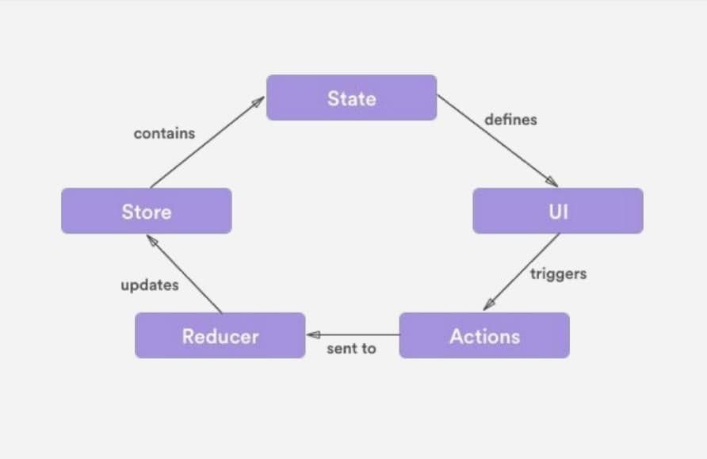

# Redux

¿Qué es Redux?

Redux is a predictable state container for JavaScript apps or
_Redux es un contenedor de estado predecible para aplicaciones JavaScript._

Lo que quiere decir es que nuestro estado estaría envolviendo a la aplicación para manejar que está haciedo, que datos tiene, que datos no tiene mi apliación y estó está almacenado en un solo lugar que va a ser nuestro Store. 

Como ejemplo: va a ser un único lugar para saber si un modal está desplegado o no está desplegado, si mi aplicación tiene ciertos datos, si mi apliación va ha actualizar algunos datos, seguro mi store lo va a saber y lo va ha tener en un solo lugar. Esto es muy interesante porque es un solo centro de la verdad.


### Historia

El creador de Redux es Adan Abramov.

"En una conferencia adan quería mostrar acerca del hot-realoading de componentes en React que es la forma de actualizar nuestra UI de React, sin que se actualice la página, Adan quería combinar está habilida que nos da webpack y combinarla con react y para esto creo Redux <3"

Redux es una forma sencilla de manipular los datos de una forma separada de la interfaz.

Luego de un Tiempo Adan es contratado para ser parte del equipo core de React y seguir haciendo 
que la tecnología que nos encanta para construir interfaces dinámicas avance.

### Motivación

Hay más cosas que estaba resolviendo Adan con Redux ya que no solo nos va a servir para el hot-mode-replacement pero hay más cosas que estaba resolviendo con Redux, nos va a servir más cosas interesantes.

¿Por qué crear Redux o estado general de la aplicación?

Simplemente porque el Fronted es muy complejo.

Ejemplos: saber si el modal está abierto o cerrado, si la aplicación tiene ciertos datos, si la apliación quiere actualizar algunos datos, si la apliación quiere pedir datos a una API, si tenemos que manejar esos callbacks, son como 4 cosas que naturamente hacemos en apliaciones fronted pero pueden haber muchos más métodos dentro del DOM que invoquen a traer nuevos datos, podemos crear nuevos estados de acuerdo ha acciones del usuario, como algunos clicks o pasar el mouse, o mostrar alguna animación, el frontend es muy complicado por todas las necesidades que tiene que resolver en ese tiempo, también era otra de las motivaciones para que React sea una buena dentro de ese stack, porque las apliaciones son cada día más dinámicas por eso es que Redux existe.

## Bases de Redux

**Store:** Es el centro de la verdad de todo, con métodos para actualizar, obtener y escuchar datos, el store esté pedazo que envuelve la apliación y vamos a tener métodos para actualizar, como por ejemplo cambiar un dato del valor A al valor B, el store lo va a saber y nos va a dar una forma de poder hacerlo, el Store siempre sabe en que estado estamos.

El store parece que lo hiciera todo en la apliación pero necesita hacer está negociación de cosas con otros 2 componentes dentro de redux:

**Acciones:** Las acciones son un bloque de información que envía datos desde la aplicación hacia el store. 

Por ejemplo; le doy un click y luego de darle un click, abrimos un modal, ese click es una acción, pero una acción puede estar por medio del usuario o puede ser algo que ocurra dentro de mi apliación, como por ejemplo: damos un click, y en ese click nos toca cargar algunos datos, algún llamado a una API y luego de algún tiempo que se complete mi método asincrono tenemos un callback y ese callback ejecuta una acción que sería actualizar algunos datos, como por ejemplo traer más listas de canciones, como agregar canciones.

En resumen las acciones pueden ser del usuario o acciones realizadas por la misma apliación.

**Reducers:** Cambian el estado de la apliación.

Esto es gracias a una función pura que toma el store y le manda cosas diferentes para que pueda actualizar ya sea para agregar o para eliminar datos.

**¿Como funcionaría nuestra apliación?**

- UI: serian nuestros componentes en React que a su vez puden enviar *triggers(disparadores)*
- Actions: Gracias a los triggers recibimos una acción como por ejemplo un click. Nuestra accion lo que hace a su vez es llamar a un reducer.
- Reducer: Le va a decir al estado que se cambie o actualice.
- Store: Espera la respuesta del Reducer. El store notifica al state que esta cambiado.
- State: Cuando el state cambia por fin volveremos a notificar a la UI.

UI -> Actions -> Reducer -> Store -> State -> UI.

Esté es un ciclo que se cumple siempre. Y esto es una de las bases de porque React es una buena idea porque tenemos datos en un sol sentido solo va a aver una forma de enviar acciones.

<div aling="center">

</div>

## Principios de Redux

1. Única fuente de la verdad - Single source of truth:
Estó quiere decir que nuestro Store lo va a saber todo, tiene que saber si algún dato a cambiado o si se va a cambiar, lo tiene que saber nuestro estado. **Aunque técnicamente podemos crear multiples Store No deberías** por cada apliación single-page deberías tener únicamente 1 store. Por ejemplo al recargar la página para ir de home a contacto, sí deberiamos tener 1 store para home y otro para contacto.

2. El estado es de solo lectura - State ir read-only: 
No podemos manipular el estado a nuestro gusto aunque podemos, porque recuerda que tenemos que actualizar las cosas por alguna acción y mi acción llamará a un reducer el cual llamá al Store, store llamá al State y el State volverá a actualizar la UI. por eso tenemos que seguir ese flujo para que no pasen cosas raras y no tengas bugs dificiles de debugear.

Como el Store lo sabe todo nosotros podemos consultarle, store ¿como estoy? y el store te va a decir ¡Estoy tal cual! y tu vas a validar esto dentro de tu interfaz.

3. Los cambios se realizan con funciones Puras - Changes are made whith pure functions:
Esto hace una referencia directa dentro a los reducers que los reducers son simplemente funciones que tiene que ser funciones puras para realizar nuestros cambios es decir que simplemente vamos a hacer una función que no sea muy compleja que sea fácil de entender y fácil de leer, estó es una función pura.

## Quizá tu apliación no necesite Redux

Para alguien con experiencia que esta tomando esté curso tendrá cierto sentido utilizar redux, pero no tiene sentido en todas las apliaciones que estas escribiendo seguramente si vas a hacer algo en tu día a día no todo va a ser totalmente complejo para que necesite redux, no todo va a tener un llamado a una API, no todo va a tener código asincrono por todas partes no todo va a ser muy interactivo, entonces no siempre tienes que decir: voy a utilizar react, entonces tengo que utilizar redux. 

No siempre tienes que meter un Stack completamente sofisticado o complejo a una apliación que no lo amerita así que te invito a reflexionarlo para que uses Redux de una forma responsable y luego no termines con aplicaciones sencillas con sobre-ingeniería, estó sería contraproducente para lo que quieres resolver con redux.

Para finalizar Redux Ama a React <3: Fueron echos para trabajer juntos aunque puden funcionar con vanilla.js o con cualquier otro framework o librería de javacript. 

En esté curso utilizaremos Redux con vanilla.js y con react, crearemos 2 proyectos diferentes implementando Redux.

## Preparando Entorno de trabajo para el Curso

Antes de codear necesitamos instalar un par de cosas para tener todo nuestro entorno y empezar a escribir el código que tanto nos gusta.

La apliación vanilla que vamos a hacer es muy sencilla simplemente vamos a tener un estado con la lista de canciones que va a ser como una abstracción de lo que hace mi apliación final con todo y UI y vamos a poder añadirle canciones que querramos por ahi simplemente con redux y con un poco de javascript es sencilo para que lo entendamos y se fácil de explicar pero no porque no podamos hacerlo más fancy completo, pero ya como en la apliación completa tenemos React vamos a utilizar React y vamos a utilizar nuestro diseño de componentes y todo lo que tenemos.

Primero tenemos que llevarnos el código que generamos en el curso de React que vas a poder encontrar [Aquí](https://github.com/JasanHdz/TubeMedia).

Puedes descargar el proyecto como un Zip, abriendolo como apliación en Desktop o clonandolo con un git clone, en esté caso lo bajaremos como zip para crear un nuevo repositorio para esté curso.

Vamos a copiar todo el código del proyecto y lo copiaremos en una nueva carpeta en esté caso la carpeta será Redux. Despues de estó solo tenemos que instalar las dependencias del proyecto haciendo un ``npm install`` dentro del proyecto.

Antes de correr nuestro proyecto tenemos que cambiar la configuración del html y ponerlo el localhost de nuestro servidor

Ahora podemos correr nuestro proyecto con ``npm run build:dev`` 

Ahora procedemos a instalar redux de la siguiente manera: ``npm install --save redux``, también es muy recomendable instalar las herramientas de desarrollo de redux para google-chrome buscando en google: ``redux devtools``

Ahora ya tenemos instalo redux en react y ya podremos ocuparlo en nuestro proyecto.

Las devTools de redux para navegar en el tiempo las apliaciones, también podemos ver el estado de la apliación y debuggear de una manera más sencilla

## Haciendo la cnfiguración inicial de Redux 

Nuestro proyecto sencillo gracias a la mágia de webpack, va a ser un nuevo entrypoint que vamos a configurar en nuestro webpack.config y webpack.dev.config.
```js
entry: {
    'home': ['babel-polyfill', path.resolve(__dirname, 'src/entries/home.js')],
    'redux': ['babel-polyfill', path.resolve(__dirname, 'src/entries/redux.js')],
  },
```
Prodemos a crear nuestro archivo redux.js y un archivo html para que cargue a nuestro entrypoint, una vez esto procedemos a cargar nuestro servidor.

Una vez hecho estó procedemos a modelar un poco nuestra apliación, nuestra apliación es muy sencilla simplemente es un formulario que tiene que actualizar nuevas cnaciones y tiene una lista de canciones, así que hagamos ese pedazo de html en nuestro archivo redux, no ocuparemos react porque en este ejercicio implementaremos redux con vanilla.js 

Para empezar nuestro proyecto crearemos un formulario con un input de tipo texto el cual será un buscador que ira actualizando el estado de nuestra apliación con redux.

1. Para empezar a maniupar a nuestro formulario tenemos que referenciarlo
2. Para escuchar su evento procedemos a añadirle el evento a nuestro elemento en esté caso es el evento submit, esté evento recibe el evento y una función que es lo que hará despues del evento.
3. Creamos la función que lo que hará es evitar que la página se recargue, luego con una API del navegador para manejar los formularios llamada: FormData() la cúal es una clase que recibe por párametro un elemento formulario de DOM, en esté caso nuestro $form.
4. Nuestra clase tiene métodos y uno muy interesante es el método GET el cual nos sirve para obtener datos de nuestro formulario por medio de su title. Lo guardaremos en una variable y lo imprimiremos en consola cada vez que se ejecute el evento submit.

```js
const $form = document.getElementById('form');
console.log('hola mundo cruel')
const handleSubmit = event => {
    event.preventDefault();
    const data = new FormData($form);
    const title = data.get('title');
    console.log(title);
}
$form.addEventListener('submit', handleSubmit);
```

## Entendiendo y agregando un Store 

Recordemos las propiedades del Store

**Store:** centro de la verdad de todo, con métodos para actualizar, obtener y escuchar cambios.

1. Contiene el estado de nuestra apliación
2. Puede acceder al estado con getState()
3. Puedes actualizar el estado con el método dispatch(action)
4. Escucha cambios con el método subscribe(listener)
5. Deja de escuchar los cambios retornando la función del método subscribe(listener)

Redux tiene un método llamado createStore, el cual podemos descoponerlo usando el destructuring de EcmaScript6 
``import { createStore } from 'redux';``

Esté método recibe 3 párametros:

1. Reducer: función pura que retorna el próximo estado 
2. PreloadState / initialState: Estado inicial de la aplicación, primer carga, llamado al api. Puede ser cualquier tipo de dato.
3. Enhancer: función que puede extender redux con capacidades añadidas por librerías externas. Es un párametro adicional, como por ejemplo la devTool de chrome que instalamos.

nuestro store sería así:
```js
import { createStore } from 'redux';
const store = createStore(
    reducer,
    initialState,
    enhancer
)
```

El reducer deberá ser una función pura, el initialState es nuestro modelado de datos, podemos hacerle incluso una referencia a la API, que también podría ser la simulación de un estado inicial, eso sería el modelado del store, en esté ejercicio, crearemos el modela como un arreglo de objetos muy sencillo como ejemplo.

```js
const initialState = [
    {
        'title': 'Despacito'
    },
    {
        'title': 'One more thing'
    },
    {
        'title': 'Echame la culpa'
    }
]
```

Para el enhancer iremos a nuestro navegador he iremos a el repositorio del redux-devtools-extension que se encuentra [Aquí](https://github.com/zalmoxisus/redux-devtools-extension) vamos a encontrar la documentación de la extensión que hemos instalado para nuestras devtools y vamos a encontrar una forma aparte de ponerla en otros entornos, como utilizarlos con nuestro store ejemplo:
```js
 const store = createStore(
   reducer, /* preloadedState, */
+  window.__REDUX_DEVTOOLS_EXTENSION__ && window.__REDUX_DEVTOOLS_EXTENSION__()
 );
```

Aquí simplemente estamos haciendole referencia a un elemento que está en window que esta en devtools, recuerda utilizar estó solo en modo desarrollo.

El Reducer es una función que debería retornar el estado esto quiere decir que la función recibirá el estado y tenemos retornar ese estado.

El Store quedaría así:

```js
const store = createStore(
    (state) => state,
    initialState,
    window.__REDUX_DEVTOOLS_EXTENSION__ && window.__REDUX_DEVTOOLS_EXTENSION__()
) 
```

Con estó tendremos nuestro Store listo, si vamos a nuestro navegador en las devtools veremos la opción de redux veremos las herramientas de redux, y ver en la pestaña de Log monitor nuestro estado inicial.

Las herramientas de redux aparte de servirme para debugear y saber que tengo en mi estado, también me van a servir para moverme en el tiempo, poder ver que está y cambiar los datos del store. Recuerda utilizar esto solo modo de desarrollo 

## Imprimiendo Datos del Estado

Ya creamos nuestro centro de la verdad, nuestro Store y nuestro Store tiene un estado, y ese estado contiene esa lista o array con nuestra lista de canciones, necesitamos obtener los datos del estado, del store para imprimirlos en nuestra aplicación y para eso está está clase.

El método del store ``getState()`` sirve para obtener los datos que tiene mi store y así podemos tener esa lista como hallamos modelado nuestros datos, arreglo o objeto,etc. Y utilizarlo dentro de mi apliación.

Como ejemplo podemos imprimirlo en consola para observar que se muestre el estado.

Ya que los tenemos vamos a crear un lugar para imprimirlos en el Dom, para ello vamos a crear un nuevo elemento html en nuestra página al cual le aremos una referencia en nuestro javascript

``<div id="playlist"></div>`` luego lo referenciamos ``const $container = document.getElementById('playlist');``.

Ya que tenemos nuestro contenedor iterar nuestra playlist para ponerla en una variable y imprimirla dentro del elemento $container de la siguiente manera:
```js
const $container = document.getElementById('playlist');
// creamos una variable con nuestro Store para poderlo iterar.
const playlist = store.getState();
// Creamos una vuelta por cada elemento.
playlist.forEach((item) => {
    // Creamos un elemento HTML de tipo Párrafo
    const template = document.createElement('p');
    // Cambiamos el TextContent del elemento que creamos, lo igualamos al item que estamos iterando con el valor de su title
    template.textContent = item.title;
    // Pegamos dentro de container el elemento creado y modificado
    $container.appendChild(template);
})
console.log(store.getState());
```

## Definiendo acciones a manejar

Ya tenemos nuestro store, nuestro store tiene el estado y nuestro estado ya está siendo utilizado por nuestra apliación para mostrar los datos al usuario he imprimirlos en pantalla.

Ahora tenemos que empezar con el siguiente flujo de datos que sería la actualización, añadirle más datos a esto y para estó están las acciones.

**Acción:** Una acción es un bloque de información que envía datos a una aplicación.

1. Las acciones se envía utilizando el método dispatch() del store
2. Las acciones son la única fuente de información del store, es la única forma que el store va a saber que algo va a cambiar.
3. Son objetos planos de Javascript: es un objeto con claves y valores

De esté objeto lo único importante y primordial es el tipo de acción, el objeto tiene que llamar a un **key type** esto es **obligatoriamente** como valor un String que sea constante por eso va en mayusculas. Y el resto de párametros que vamos a enviar en una acción por medio del objeto van a ser totalmente opcionales, en esté caso enviamos los datos por una key que se llamá *payload* que es de convección en aplicaciones con React aunque podrías ponerle cualquier otro nombre.

Terminando y usando el método dispatch quedaría de la siguiente manera:
```js
store.dispatch({
    type: 'ADD_SONG',
    payload: 'Despacito'
})
```

¿Cuando deberíamos de utilizar una acción?

Cada vez que actualicemos los datos, como en el ejemplo anterior deberíamos estar actualizando los datos cada vez que el usuario hace un evento submit y se agregan nuevos datos a el estado, nosotros deberíamos estar actualizando la lista de elemento en el dom.

La acción debería de ir donde obtenemos nuevos datos en este caso en la función handleSubmit
```js
const handleSubmit = event => {
    event.preventDefault();
    const data = new FormData($form);
    const title = data.get('title');
    console.log(title);
    store.dispatch({
        type: 'ADD_SONG',
        payload: {
            title
        }
    })
}
```
Hay acciones que no necesitan datos opcionales como por ejemplo: mostrar el modal podría ser un toggle, si le mando 1 vez mostrar modal lo que va a ser es mostrarlo y si le mandamos otra vez mostrarmodal y si estaba en true lo convertirá a false, pero en muchos casos también nos va a servir enviarle datos adicionales, así que nosotros podríamos ponerle lo que nostros queramos de dato adicional.

Algo que tambíen vamos a agradecer de enviar datos adicionales y no tener que volver a manipular nuestro reducer es que mejor le enviemos un objeto, porque por ahora enviamos el title, pero que tal si el formulario también nos da el artista, el author etc..

## Actualizando el Store con Reducers

Ya tenemos creado un Store que a su vez le hemos puesto un estado inicial y ya estamos enviandole acciones para querer actualizarlo pero no lo estamos actualizando y nos falta el 3er eje de nuestro ciclo de cosas que hace Redux y son los Reducers.

**Reducer:** Modifican el estado 

1. Un reducer es una función pura.
2. Puede haber más de un reducer en una aplicación pero solo debe de haber 1 solo store 
3. Devuelve el siguiente estado.

**Nunca hacer en Reducers**

1. Modificar sus argumentos 
2. Realizar tareas con efectos secundarios como llamados a APIs
    - Los reducer deberían ser tan sencillos como podamos para que haga tareas rutinarias como agregar, poner, quitar, etc. Nada tan sofisticado, ningún calculo tan complicado y en esté caso una tarea con efecto secundario como una llamadá a un API
    - Porque las llamadas a un api pueden traerme resultados diferentes por ejemplo si quisiera llamar a los ultimos post del blog, dentro de un reducer, técnicamente podriamos hacerlo, mando esa llamada a la api con fetch o con ajax, me devuelve el post del blog y puede que el último post sea 'como funciona react16', puede que cuando yo vuelva a llamar a la misma acción y pase por el mismop reducer y llame al último post, me devuelva otra cosas que no sea el string anterior. Aquí estaríamos incumpliendo lo que hacen las funciones puras.
3. Llamar a funciones no puras como Date.now() o Math.random().

## ¿Qué es una función  pura?

Es un concepto y columna vertebral de la programación funcional que nos va ayudar a tener un código más limpio, más debugeable, más legible.

Para que una función sea Pura tiene que cumplir con 2 condiciones muy importantes.

1. "Dados los mismos párametros/argumentos/entradas deben retornar el mismo resultado sin importar el número de veces que se llamé"
    - Por ejemplo: si tenemos una función que realiza una suma y recibe 2 párametros si le envío 2 y 2 siempre debería retornarme 4.
2. "La función no debería tener efectos secudarios"
    - Asi como hacer llamados a una api que puede traer datos diferentes dependiendo lo que hagamosp, Date.now() siempre traerá datos diferentes y Math.random(), al no ser siempre lo mismo puede afectar el resultado de mi función. **Estó hace inpura a mi función y no debemos de hacer eso dentro del reducer.**

El reducer se vería de la siguiente manera:
```js
const reducer = function (state,action) {
    // qué hago con el estado y la acción 
}
```
Estó es una función sencilla que recibe 2 párametros, lo estamos poniendo dentro de una constante que se llamá reducer, está función recibe el state y la action 

Con mi estado ya que lo tengo ahí ya lo puedo actualizar, hacerle algo y cambiarle algó dentro de mi estado y con mi acción puedo validar que hacer con mi estado dependiendo el tipo de acción que me llegue, si me llegá agregar canción, pues le agregó la cnación a mi estado y si me llegá delete song tenemos que quitar la canción y así podemos validar eso.

Como esto es JavaScript podemos hacer aquí lo que queramos, y para validar el tipo de acción podemos hacer un if, pero lo que normalmente se ocurre ya que estamos validando una misma variable que nos está llegando en el type en action es hacer un *switch* para que sea más legible. Ejemplo:
```js
const reducer = function(state, action) {
   switch(type.action) {
      case 'ADD_SONG':
         return[...state, action.payload]
         break;
      default:
         return state;
         break;
   }
}
```

## Actualizando la aplicación en cada cambio con Subscribe

Ya estamos enviando acciones que pasan al reducer, el reducer actualiza por medio del store el estado y el estado actualiza mi aplicación, bueno esté ultimo aún nos hace falta.

Sabemos que:

    Envió           que se envía a            Gestiona cambios      Contiene estado que se a actualizado
UI -->      Action (ADD_SONG) -->       Reducer -->                                 Store -->

Redefine      Como se ve
State -->         UI.           --> Regresamos al ciclo.

Para actualizar nuestro UI usamos un método del store que se llamá subscribe,  el cual es una función que recibe 1 solo párametro que va a ser una función, está función se escuche algún cambio en nuestro estado, en esté caso llamaremos a la función que renderéa la UI de nuestros datos.

Método Subscribe:
```js
const handleChange = function() {
    render();
}
store.subscribe(handleChange)
```
Código Completo
```js
// Cargamos método para Crear Store
import { createStore } from 'redux';

// Escuchamos Acción de la Interfaz
const $form = document.getElementById('form');
console.log('hola mundo cruel')
const handleSubmit = event => {
    event.preventDefault();
    const data = new FormData($form);
    const title = data.get('title');
    console.log(title);
    // Lanzamos Dispach, lanzá una Acción al Reducer.
    store.dispatch({
        type: 'ADD_SONG',
        payload: {
            title,
        }
    })
}
$form.addEventListener('submit', handleSubmit);

// Estado Inicial de nuestro Store
const initialState = [
    {
        'title': 'Despacito'
    },
    {
        'title': 'One more thing'
    },
    {
        'title': 'Echame la culpa'
    }
]

// Gestiona Cambios y actualiza el estado 
const reducer = function(state, action) {
    switch(action.type) {
        // Si se lanza la acción de ADD_SONG actualiza estado
        case 'ADD_SONG':
            return [...state, action.payload]
        break;
        // Si no se lanza ninguna otra opción solo retorna el estado.
        default:
            return state;
        break;
    }
}

// Creamos el Store
const store = createStore(
    // Getionador de Cambios
    reducer,
    // Estado Inicial
    initialState,
    // Enhancer: para ver los cambios de nuestro estado en el tiempo.
    window.__REDUX_DEVTOOLS_EXTENSION__ && window.__REDUX_DEVTOOLS_EXTENSION__()
) 

// Función render que imprime los datos del Estado
function render() {
    const $container = document.getElementById('playlist');
    const playlist = store.getState();
    $container.innerHTML = '';
    playlist.forEach((item) => {
        const template = document.createElement('p');
        template.textContent = item.title;
        $container.appendChild(template);
    })
}
render();

// Llama al Render Cada vez que el estado se halla Actualizado
const handleChange = function() {
    render();
}

// El método Subscribe se ejecuta cuando se actualiza el estado.
store.subscribe(handleChange)

console.log(store.getState());
```

## Instalando React-redux

Ya tienes los conceptos básicos para hacer tus apliaciones con redux y en esté modulo lo que vamos a hacer es integrarlo a una aplicación con React, pero ya tienes el conocimiento.

Para integrar redux a una apliación con React necesitamos de una dependencia extra que se llamá [React-Redux](https://github.com/reduxjs/react-redux), ya que es una dependecia que hicieron los mismos desarrolladores que mantienen ReactJs.

Simplemente va a tener una API muy sencilla que se basa de un provider-conect que lo iremos profundizando a lo largo de las clases.

instalación:
``npm install --save react-redux``

Ahora ya podemos modificar nuestro proyecto, en el cual tenemos que:
- hacer busquedas
- Agregar elementos
- quitar otros.

Tenemos que hacer que Redux se adueñe de nuestra apliación que empiece a utilizar un Store más hemogeneo y luego añadirle más acciones para que realice las busquedas, etc.

## Puliendo la estructura de datos 

Algó que vamos a agradecer muchisímo al momento de estar trabajando con datos es que pues estén bien estructurados, para esto tenemos que hacer unos ligeros ajustes a nuestro api.json, estó lo vamos a agradecer cuando estemos haciendo algunas cosas con react en el futuro.

1. Lo que vamos a hacer es que todos los ids que vengan en nuestro json que vienen como números volverlos textos
2. Lo segundo que necesito es que todos los ids sean homogeneos y diferentes.

## Agregando Store al proyecto de react.

Ya instalamos la nueva dependencia en nuestro proyecto que se llamá react-redux, ya tenemos instalado redux, ya arreglamos nuestro modelo de datos del api, y ahora vamos a hacer los mismo que teníamos en nuestro proyecto vanilla.js pero ahora sí con react y lo vamos a poner dentro de nuestro proyecto, recordemos que en estries -> home.js tenemos donde arrancá nuestro proyecto.

Así que acá es donde vamos a importar tal cual como hicimos en redux 
``ìmport { createStore } from 'redux' ``

Ahora tenemos que hacer nuestro store e igual como lo habiamos echo anterioremente.
```js
import data from '../api.json';
const initialState = {
    data: {
        ...data
    }
}

const store = createStore(
    (state) => state,
    initialState,
    window.__REDUX_DEVTOOLS_EXTENSION__ && window.__REDUX_DEVTOOLS_EXTENSION__()
)

```

Ya hemos empezado la integración del proyecto Media con redux creando nuestro store pero nuestro store todavía no se ha conecado todavía no está incluido con nuestros datos de la aplicacíon, sigue siendo la UI y el store por un lado tenemos que mesclarlos ahora y para eso es está clase.
Para eso tenemos que importar un height-order-componente que nos entrega react-redux que se llamá provider, esté nos va a hacer a la vez como un poquito de subscribe más o menos va a remplazarlo, ya no vamos a utilizar subscribe ya van a a saber porque y provider va a servir para ponerle los datos a la aplicación a esté store, y es un componente que vamos a poner como tag de react. Es un componente especial, no es un componente cualquiera que es un componente que le llamán height-order-component (componente de orden superior) 

que tienen de interesante los componente de orden superior, van a heredarle cosas a los componente hijos, mira esto como si fuera un decorador, un mixing, los hight-order-component remplazan a los mixings para expenderle funciones o propiedades y en esté caso va extenderle propiedades, va a extenderle nuestro store así que el provider va a tener una propiedad que va a recibir, un key que se llamá store y ha esté le vamos a pasar nuestro store que ya hallamos creado y ahora tenemos que envolver nuestro home en ese provider, ahora a lo que le vamos a hacer render es a nuestro provider.

Lo que va a pasar ahora en la aplicación esque se va a romper por completo porque no le estoy enviando datos

Ahora tenemos que aprender a consumir los datos que tiene mi provider, el store que está almacenando el provider dentro de los componentes que necesitan ciertas cosas como por ejemplo las categorías que renderéan la categroría, el elemento de la playlist que rendereá su playlist pero ya concectados con redux.

Estamos llendo paso a paso con nuestra aplicación creando primero el store luego, poniendo nuestro store a nuestra apliacación luego gracias al provider que es un heigth-order-component y ahora que ya tenemos esas 2 cosas ponemos empezar a consumir los datos, estó es lo que vamos a hacer ahora y es conectar datos en especifico dentro de nuestros componentes, entonces una de las hanbilidades interesantes de redux es que vamos a obtener los datos que necesita nuestro componente, esto siginifica que podemos enviarle un pedacito del state de mi estado general a cierto comoponente. 

Nuestro componente proncipal de aplicación espera datos y no le estamos enviando ninguna dato, y espera que le lleguen por propiedades que le llegue está propiedad que son categories, y si no le llega está propiedad no puede renderear lo que tienen adentro  y eso es lo que vamos ha arreglar ahora.

Para conectar los datos del store a un componente en especifico tenemos que utilizar otra habilidad de react-redux que también es parte de lo que hace subscribe, bien ahora tenego que concectar esos datos a mi componente y concect va a ser una función especial, una función que devuelve una función que al final es una función currificada, algunos conceptos raros de programación funcional. La cosa es que va a ser una función que va recibir un párametro donde vamos a ponder especificar que datos necesitamos y los datos que necesitamos los vamos a obtener del state. 

Tengo que pasarle estos 2 datos a la función primero que componente y luego una fiu